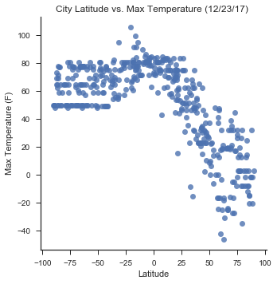
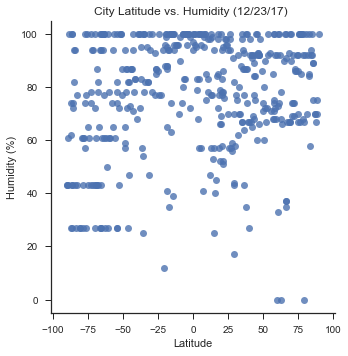
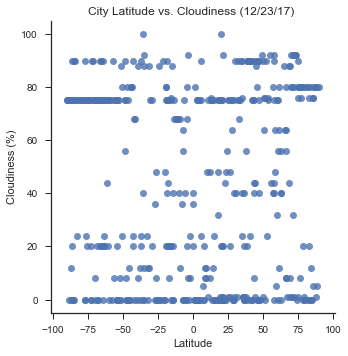
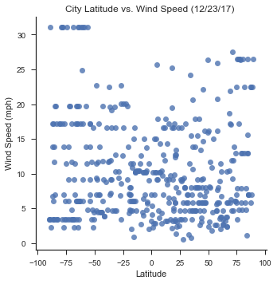

```python
# Dependencies
import json
import requests as req
import pandas as pd
#What is the diff between using from citipy and just saying import?
from citipy import citipy
import random
import sys
import time
import seaborn as sns
import matplotlib.pyplot as plt
%matplotlib inline
```


```python
# Save config information
api_key = "cba3c9625e1128ba7996892ff6dda615"
url = "http://api.openweathermap.org/data/2.5/weather?"
units = "imperial"

# Build partial query URL
query_url = url + "appid=" + api_key + "&units=" + units + "&q="
```


```python
#Initialize lists and variables
latstart = -90.00
latend = 90.00
lonstart = -180.00
lonend = 180.00
final_list = []
```


```python
#Function to generate a given number of random float numbers in a given range
def generate_random_latlng(start, end, num_rows):
    final_list = []
    for x in range(0,num_rows):
        coord= random.uniform(start,end)
        coord1 = round(coord,5)
        final_list.append(coord1)
    return final_list
```


```python
#Get random latitudes and longitudes
lat_list = generate_random_latlng(latstart, latend, 500)
lat_list
```


    [-60.73752,
     81.85622,
     -18.36152,
     -4.14505,
     -26.55228,
     -3.57228,
     -35.55047,
     32.06997,
     -63.53442,
     87.14448,
     36.19933,
     -35.56516,
     -60.36903,
     -31.66033,
     48.14187,
     61.00097,
     85.56132,
     9.56997,
     44.57943,
     77.20807,
     -75.91977,
     4.27175,
     -9.15047,
     19.8886,
     -7.41391,
     -15.21709,
     -20.25276,
     45.09138,
     78.72159,
     33.14907,
     -61.66079,
     85.21055,
     29.83066,
     -64.71261,
     -73.09819,
     78.75975,
     3.84869,
     66.08416,
     83.16144,
     -52.56832,
     15.05974,
     73.77181,
     76.71071,
     -4.20001,
     45.48089,
     78.73341,
     -74.25414,
     -27.28181,
     68.67716,
     -14.45869,
     -67.87219,
     -22.51241,
     -42.8628,
     -86.11966,
     58.24533,
     54.65046,
     75.34177,
     -77.4301,
     71.97933,
     -43.41369,
     -26.57237,
     57.13334,
     50.60264,
     -65.47152,
     -76.5017,
     89.38788,
     -63.60875,
     -25.07231,
     -44.94556,
     29.03294,
     -36.81906,
     44.48231,
     -51.19458,
     -27.73924,
     -13.67455,
     -72.92425,
     89.73926,
     8.89424,
     -64.84603,
     -39.4976,
     -88.73565,
     -47.93218,
     -26.62748,
     31.88121,
     -35.26708,
     -14.3884,
     -37.46031,
     -41.38202,
     -16.79846,
     -86.50034,
     -21.31412,
     -13.794,
     -57.28493,
     -79.45239,
     74.65069,
     -62.83251,
     0.26376,
     -2.44444,
     -83.72868,
     32.25887,
     8.94409,
     -68.10324,
     -54.40633,
     85.4909,
     -65.88047,
     61.75594,
     69.69879,
     40.21513,
     -18.26148,
     30.24107,
     -11.43243,
     35.8298,
     19.72286,
     -53.75283,
     60.717,
     22.22035,
     0.4371,
     -17.60455,
     -32.69008,
     -34.62416,
     36.56854,
     86.53169,
     -42.82514,
     -69.90107,
     43.98522,
     62.93862,
     28.90464,
     42.40838,
     62.73661,
     31.11678,
     -84.9036,
     -82.77204,
     38.1569,
     -6.78717,
     32.07018,
     36.37924,
     -18.89788,
     84.71379,
     81.98819,
     37.07884,
     32.90338,
     18.42205,
     -46.62015,
     -43.84074,
     41.81391,
     36.41299,
     14.01547,
     53.30076,
     -56.51285,
     -75.19386,
     27.47317,
     -2.55102,
     -13.9328,
     -54.37863,
     -89.97856,
     36.34131,
     -67.53372,
     -0.08325,
     -19.97662,
     82.71083,
     -60.1087,
     -6.4782,
     -54.14013,
     53.44273,
     12.84874,
     28.92466,
     65.18731,
     -78.26679,
     8.62888,
     70.71384,
     81.71552,
     68.95819,
     26.45342,
     61.60417,
     13.69342,
     38.89325,
     80.34641,
     -45.43638,
     66.03779,
     -39.89244,
     -59.30458,
     -6.9824,
     21.45843,
     -65.64786,
     -61.97875,
     -42.29115,
     -11.29595,
     45.56532,
     70.62725,
     29.37195,
     66.64719,
     77.81835,
     57.90315,
     1.14636,
     -59.28213,
     -52.65323,
     -50.82922,
     10.46146,
     13.70613,
     19.12062,
     74.65817,
     63.18238,
     -16.0991,
     -15.88481,
     5.99693,
     -4.75874,
     -65.72939,
     18.86047,
     -51.88044,
     51.92749,
     47.16857,
     18.01907,
     79.81497,
     20.81879,
     23.45645,
     74.93052,
     18.19215,
     19.51758,
     26.24874,
     -37.85032,
     72.47377,
     61.17214,
     -71.43934,
     -47.68902,
     -68.41654,
     -15.14481,
     75.15925,
     -19.04708,
     47.36078,
     87.37126,
     -46.0785,
     -85.25547,
     35.13104,
     -89.25707,
     60.49447,
     84.47298,
     16.94507,
     -54.32778,
     7.85038,
     -44.50847,
     -24.43287,
     2.88816,
     57.5471,
     -43.99545,
     -65.69876,
     1.54225,
     66.27102,
     80.34595,
     -3.43655,
     40.14406,
     -46.18172,
     -11.01222,
     -76.73922,
     88.41053,
     -64.09226,
     28.04974,
     -69.19291,
     38.02974,
     20.49016,
     74.24468,
     -48.152,
     -45.43141,
     42.24743,
     -41.77183,
     -35.03025,
     -61.44765,
     34.06566,
     -18.53178,
     -5.244,
     65.95916,
     27.5314,
     -72.18651,
     -87.09304,
     49.32352,
     85.48366,
     -46.92501,
     83.68686,
     84.31763,
     16.45516,
     87.06373,
     -84.38041,
     -47.48631,
     77.84432,
     -17.37201,
     57.97835,
     49.88411,
     69.01876,
     -19.50674,
     -78.80803,
     -69.70531,
     79.43241,
     -15.53037,
     -86.62752,
     10.4907,
     -31.79261,
     -63.37067,
     -39.96672,
     -48.43235,
     14.98982,
     20.83349,
     21.75609,
     12.9927,
     -50.37234,
     35.32983,
     21.89754,
     -65.50844,
     85.74658,
     -68.81787,
     68.21933,
     14.18072,
     43.64047,
     82.74567,
     71.87157,
     11.84154,
     4.20523,
     51.23876,
     5.43976,
     36.06447,
     33.59384,
     55.67126,
     -48.36708,
     -71.15888,
     -66.35515,
     28.35347,
     -66.36589,
     70.1415,
     85.76182,
     20.23346,
     -67.36902,
     51.45544,
     81.09659,
     2.83361,
     57.59373,
     -86.19265,
     35.5457,
     26.37394,
     -63.26144,
     43.28691,
     -48.62481,
     50.51003,
     -70.15552,
     58.79083,
     20.57828,
     59.44644,
     60.02598,
     40.8377,
     77.3615,
     38.03072,
     -32.31802,
     10.35151,
     12.51972,
     -24.61006,
     -4.26204,
     20.95569,
     41.92861,
     12.65129,
     35.00248,
     2.01996,
     -87.03345,
     75.61317,
     42.63859,
     46.8382,
     58.1663,
     -63.739,
     57.77917,
     20.22078,
     -66.20197,
     -9.48564,
     40.34165,
     73.01805,
     22.5475,
     -68.971,
     -15.73519,
     62.76201,
     21.19011,
     -46.87765,
     -64.60081,
     29.05809,
     25.5129,
     88.73704,
     -53.96752,
     76.7007,
     -43.04385,
     -73.14096,
     -57.20081,
     -78.74785,
     -74.82724,
     -50.94868,
     81.78506,
     -5.93866,
     -77.70702,
     15.04174,
     74.70275,
     71.24341,
     -89.71868,
     -85.87374,
     49.98885,
     89.51111,
     4.42948,
     3.57481,
     -26.81948,
     15.44721,
     60.08562,
     -70.05687,
     66.34632,
     85.19023,
     23.42739,
     4.91027,
     46.10237,
     -19.04469,
     7.17194,
     -12.27204,
     -0.26892,
     33.96092,
     34.67079,
     -35.21395,
     87.612,
     21.56432,
     87.34042,
     -82.654,
     -30.71751,
     -14.03278,
     -54.09691,
     -44.97937,
     -57.92019,
     -16.80635,
     47.3713,
     43.66081,
     33.30377,
     39.55736,
     76.21772,
     30.77326,
     60.73251,
     38.50504,
     38.60853,
     -78.56553,
     0.85387,
     -7.46308,
     -51.47506,
     -29.16125,
     46.17384,
     -55.98817,
     -89.32883,
     -37.54078,
     -48.23353,
     -18.92608,
     84.7338,
     -15.60833,
     78.19812,
     69.18151,
     25.08569,
     17.82234,
     57.24309,
     11.95627,
     -16.03284,
     17.79545,
     -80.72704,
     19.5539,
     -80.44851,
     -9.94502,
     82.87332,
     -8.05236,
     -77.15224,
     21.1688,
     6.93498,
     79.14899,
     25.29162,
     -86.48138,
     32.68696,
     43.74246,
     5.71404,
     -0.16692,
     -87.28174,
     -72.82916,
     -1.96007,
     41.74803,
     3.3747,
     66.11509,
     -36.77816,
     -20.89156,
     67.23578,
     53.14879,
     -85.72134,
     -7.21559,
     71.0386,
     -31.62775,
     -72.76749,
     -18.27556,
     4.56378,
     82.2178,
     -60.06313,
     -35.74451,
     46.5986,
     -38.90667,
     4.33003,
     24.53732,
     -77.04099,
     7.7018,
     -83.94893,
     -28.96747]


```python
lon_list = generate_random_latlng(lonstart,lonend,500)
lon_list
```


    [145.26758,
     37.38974,
     -49.34467,
     -151.7439,
     -45.80095,
     138.48386,
     166.09901,
     6.4303,
     -118.81565,
     156.62556,
     -27.25653,
     -67.68436,
     -124.92056,
     -21.2322,
     -39.11733,
     -141.79868,
     129.47348,
     -63.87092,
     26.72224,
     41.76499,
     -121.74606,
     22.41483,
     -41.90246,
     137.97249,
     125.03898,
     -1.28528,
     -88.70162,
     -179.96965,
     -92.11971,
     140.33486,
     53.96584,
     62.1138,
     5.13307,
     -132.00829,
     -120.01842,
     -27.69198,
     28.10027,
     -51.91989,
     41.39986,
     -66.44208,
     -141.47617,
     174.4541,
     3.71106,
     -93.28017,
     -55.00539,
     -48.55855,
     -84.66423,
     -42.77122,
     139.82549,
     -128.51407,
     -49.29534,
     110.69826,
     -125.43056,
     -18.01908,
     10.64846,
     10.79665,
     79.65669,
     162.488,
     -67.80254,
     -95.28574,
     -38.52529,
     81.12299,
     66.49445,
     143.67988,
     128.68834,
     138.18622,
     19.95596,
     -63.13215,
     171.46128,
     154.13918,
     -78.36083,
     -41.66311,
     11.70235,
     20.1909,
     -97.50077,
     -74.64893,
     70.10082,
     71.02448,
     -106.59222,
     -15.15294,
     6.39946,
     56.72949,
     -83.92998,
     134.20859,
     -49.60698,
     121.42564,
     -47.60873,
     -88.25012,
     66.71946,
     -89.08583,
     -178.58653,
     69.63707,
     -170.37099,
     -105.6782,
     -10.98376,
     149.98696,
     133.49049,
     -114.39861,
     125.27272,
     9.605,
     23.13164,
     82.32631,
     149.09728,
     126.15781,
     -149.12079,
     -54.01135,
     54.91253,
     66.8449,
     -174.44407,
     -82.21094,
     -100.60269,
     -124.04255,
     124.18517,
     -147.25121,
     -22.1684,
     82.51487,
     -13.33397,
     -50.72696,
     -97.03056,
     9.49913,
     -6.88661,
     -14.84766,
     174.89259,
     121.85861,
     -92.85963,
     130.65402,
     3.07293,
     57.448,
     104.34104,
     -92.55728,
     -167.82554,
     -35.55349,
     110.51048,
     -161.74688,
     -48.13001,
     111.02691,
     -60.43459,
     -78.22409,
     -68.14513,
     71.34038,
     78.2241,
     -142.82828,
     47.66766,
     51.20743,
     -50.93697,
     -141.14919,
     136.14202,
     107.84515,
     37.00636,
     -165.90523,
     -145.96555,
     0.15623,
     -140.23269,
     103.46725,
     -26.85863,
     -150.82325,
     -3.18639,
     22.21,
     19.84981,
     -118.18328,
     95.13168,
     49.18546,
     -136.01092,
     46.20798,
     50.7166,
     -114.21707,
     50.79323,
     -44.40804,
     130.38639,
     88.64521,
     142.91338,
     -38.27896,
     166.67888,
     61.1993,
     -115.7767,
     -64.97506,
     70.0326,
     1.09151,
     141.68174,
     -145.37025,
     -82.19036,
     -116.53492,
     113.51572,
     -174.00212,
     -87.24201,
     104.23289,
     92.65022,
     112.23038,
     -73.45233,
     37.27498,
     158.95492,
     75.46836,
     145.91041,
     11.96043,
     -153.63844,
     124.98214,
     46.99937,
     -100.79265,
     91.16085,
     48.06673,
     -159.92841,
     -100.64931,
     -124.55464,
     135.90032,
     111.03109,
     -145.72868,
     -134.13112,
     -113.25929,
     30.89708,
     -159.36337,
     14.42515,
     -109.36581,
     -78.29328,
     -80.25171,
     -119.97634,
     3.37296,
     -21.19451,
     93.95803,
     -75.07911,
     120.59041,
     10.96693,
     -59.19899,
     -178.84013,
     105.04997,
     30.96484,
     92.42145,
     22.81798,
     -112.40012,
     11.58633,
     135.19381,
     8.69309,
     -12.61275,
     -39.00918,
     -95.80525,
     95.33986,
     174.61169,
     69.0986,
     -3.7009,
     92.8733,
     -85.71837,
     0.68197,
     112.27038,
     -65.10794,
     -107.60684,
     -38.76992,
     -137.53375,
     103.11187,
     -22.72679,
     5.80702,
     -149.69668,
     150.9299,
     -95.05838,
     21.82255,
     -99.347,
     -173.9854,
     88.29762,
     -46.74192,
     -127.63468,
     -168.62898,
     -75.58292,
     -23.87023,
     166.5088,
     -5.86675,
     -83.42107,
     -20.19914,
     -35.00021,
     92.83581,
     -161.4336,
     -140.45505,
     -53.45198,
     -21.9891,
     -178.90352,
     143.86263,
     -65.74548,
     -112.13618,
     -91.88899,
     -66.40576,
     -82.41321,
     24.94479,
     143.97489,
     -176.31628,
     -157.9058,
     37.50712,
     -124.57989,
     -164.32032,
     -114.79343,
     -152.04999,
     20.93335,
     64.0774,
     -43.96868,
     106.69897,
     -120.35563,
     58.06434,
     -170.88937,
     0.57488,
     -119.53423,
     125.62664,
     77.4348,
     53.68411,
     -108.1693,
     33.75495,
     -151.42499,
     22.96043,
     -96.92066,
     -125.5182,
     141.83556,
     40.03185,
     -64.52205,
     71.75367,
     -10.75398,
     127.16984,
     -9.58697,
     92.35007,
     -14.24461,
     -135.23398,
     42.28931,
     -158.23609,
     43.82712,
     156.12479,
     -179.57012,
     -163.78346,
     -34.74173,
     -172.31194,
     21.44213,
     146.79364,
     -11.25665,
     39.16624,
     -56.02597,
     -166.15362,
     78.8428,
     -17.74233,
     56.5602,
     -179.78562,
     -136.95256,
     -130.65695,
     -136.14233,
     -114.81773,
     65.82714,
     69.35718,
     96.98087,
     46.63048,
     70.01922,
     -50.75043,
     -106.0729,
     135.12363,
     -47.73644,
     84.79352,
     162.82645,
     12.80212,
     173.22018,
     115.4497,
     89.28031,
     65.85748,
     143.24752,
     175.23793,
     -116.34143,
     79.2802,
     15.68706,
     179.09351,
     -61.62193,
     147.02852,
     162.89906,
     -7.07887,
     -84.69816,
     23.0833,
     27.9405,
     -123.01924,
     119.51144,
     -37.68835,
     172.5348,
     -89.55407,
     -108.0381,
     117.61645,
     -72.52816,
     -165.37,
     114.34491,
     7.25396,
     -54.80269,
     -147.94209,
     155.28317,
     166.06769,
     -40.44176,
     -176.22972,
     65.64391,
     -164.60608,
     129.93342,
     -32.75637,
     -88.51477,
     -31.51455,
     -27.47955,
     -95.98495,
     -80.32983,
     149.49318,
     115.84537,
     -52.44209,
     92.31866,
     -170.73739,
     4.37748,
     106.2155,
     -123.70319,
     93.76538,
     36.99523,
     72.75954,
     150.4021,
     57.85975,
     11.2381,
     169.55066,
     59.20992,
     -45.49872,
     79.90411,
     -107.97472,
     -94.14361,
     -170.45339,
     -76.40267,
     -21.36211,
     113.30415,
     -154.02326,
     -99.88026,
     55.14727,
     20.37848,
     68.98227,
     -130.61731,
     137.62063,
     -146.34279,
     160.00992,
     109.14879,
     -51.29018,
     -18.36496,
     148.64582,
     -151.23346,
     86.10218,
     -25.11545,
     -88.41172,
     51.16069,
     -11.9561,
     -88.7504,
     173.20577,
     -126.92979,
     -13.94255,
     165.27655,
     -18.64407,
     -83.8203,
     -75.78377,
     177.27181,
     179.90387,
     -172.51302,
     80.03971,
     51.7984,
     20.26564,
     7.97152,
     153.9688,
     114.35966,
     -70.40926,
     163.71397,
     -143.18168,
     159.33687,
     149.93214,
     -132.18834,
     125.34581,
     145.65063,
     -58.9613,
     103.8966,
     74.6359,
     36.68629,
     -135.21103,
     -149.3955,
     -135.58585,
     133.09569,
     158.32455,
     142.38895,
     -30.12089,
     -81.32938,
     164.7863,
     95.17038,
     130.92752,
     -154.37434,
     31.14254,
     104.66007,
     57.86808,
     131.09298,
     -153.54954,
     136.10479,
     150.61554,
     159.33769,
     -168.81993,
     156.05461,
     156.75292,
     155.64211,
     -160.38722,
     -33.03659,
     -95.2051,
     131.31697,
     -62.74348,
     28.7439,
     59.88104,
     -99.93936,
     10.24395,
     89.89834,
     -57.86059,
     -23.3517]


```python
city = citipy.nearest_city(13.88283, 46.51722)
print(city.city_name + ", " + city.country_code)

```

    lahij, ye
    


```python
city_data_df = pd.DataFrame({"lat": lat_list,"lng": lon_list})
city_data_df["City"] = ""
city_data_df["Cloudiness"] = ""
city_data_df["Country"] = ""
city_data_df["Date"] = ""
city_data_df["Humidity"] = ""
city_data_df["Max Temp"] = ""
city_data_df["Wind Speed"] = ""
city_data_df["drop"] = ""
city_data_df.head()
```


<div>
<style>
    .dataframe thead tr:only-child th {
        text-align: right;
    }

    .dataframe thead th {
        text-align: left;
    }

    .dataframe tbody tr th {
        vertical-align: top;
    }
</style>
<table border="1" class="dataframe">
  <thead>
    <tr style="text-align: right;">
      <th></th>
      <th>lat</th>
      <th>lng</th>
      <th>City</th>
      <th>Cloudiness</th>
      <th>Country</th>
      <th>Date</th>
      <th>Humidity</th>
      <th>Max Temp</th>
      <th>Wind Speed</th>
      <th>drop</th>
    </tr>
  </thead>
  <tbody>
    <tr>
      <th>0</th>
      <td>-60.73752</td>
      <td>145.26758</td>
      <td></td>
      <td></td>
      <td></td>
      <td></td>
      <td></td>
      <td></td>
      <td></td>
      <td></td>
    </tr>
    <tr>
      <th>1</th>
      <td>81.85622</td>
      <td>37.38974</td>
      <td></td>
      <td></td>
      <td></td>
      <td></td>
      <td></td>
      <td></td>
      <td></td>
      <td></td>
    </tr>
    <tr>
      <th>2</th>
      <td>-18.36152</td>
      <td>-49.34467</td>
      <td></td>
      <td></td>
      <td></td>
      <td></td>
      <td></td>
      <td></td>
      <td></td>
      <td></td>
    </tr>
    <tr>
      <th>3</th>
      <td>-4.14505</td>
      <td>-151.74390</td>
      <td></td>
      <td></td>
      <td></td>
      <td></td>
      <td></td>
      <td></td>
      <td></td>
      <td></td>
    </tr>
    <tr>
      <th>4</th>
      <td>-26.55228</td>
      <td>-45.80095</td>
      <td></td>
      <td></td>
      <td></td>
      <td></td>
      <td></td>
      <td></td>
      <td></td>
      <td></td>
    </tr>
  </tbody>
</table>
</div>


```python
# Loop through the cities_pd and run a lat/long search for each city
for index, row in city_data_df.iterrows():
    try:
        lat = row["lat"]
        lng = row["lng"]
    # Get City and Country from Citypy library using lat and long
        city = citipy.nearest_city(lat,lng)
        city_name = city.city_name
        country_code = city.country_code
    # Store the target url for each city and print    
        target_url = query_url + city_name + "," + country_code
        print(target_url)
    #Call the target url to retrieve weather data by city    
        city_weather = req.get(target_url).json()
    #Update the dataframe with weather data via index    
        city_data_df.set_value(index, "Date", city_weather["dt"]) 
        city_data_df.set_value(index, "Cloudiness", city_weather["clouds"]["all"]) 
        city_data_df.set_value(index, "Humidity", city_weather["main"]["humidity"])
        city_data_df.set_value(index, "Max Temp", city_weather["main"]["temp_max"])
        city_data_df.set_value(index, "Wind Speed", city_weather["wind"]["speed"])
        city_data_df.set_value(index, "City", city_name)
        city_data_df.set_value(index, "Country", country_code)
    except: 
        if(city_weather["cod"] == "404"):
            city_data_df.set_value(index, "drop",0) 
        continue
```

    http://api.openweathermap.org/data/2.5/weather?appid=cba3c9625e1128ba7996892ff6dda615&units=imperial&q=hobart,au
    http://api.openweathermap.org/data/2.5/weather?appid=cba3c9625e1128ba7996892ff6dda615&units=imperial&q=tumannyy,ru
    http://api.openweathermap.org/data/2.5/weather?appid=cba3c9625e1128ba7996892ff6dda615&units=imperial&q=itumbiara,br
    http://api.openweathermap.org/data/2.5/weather?appid=cba3c9625e1128ba7996892ff6dda615&units=imperial&q=faanui,pf
    http://api.openweathermap.org/data/2.5/weather?appid=cba3c9625e1128ba7996892ff6dda615&units=imperial&q=iguape,br
    http://api.openweathermap.org/data/2.5/weather?appid=cba3c9625e1128ba7996892ff6dda615&units=imperial&q=vanimo,pg
    http://api.openweathermap.org/data/2.5/weather?appid=cba3c9625e1128ba7996892ff6dda615&units=imperial&q=ahipara,nz
    http://api.openweathermap.org/data/2.5/weather?appid=cba3c9625e1128ba7996892ff6dda615&units=imperial&q=tuggurt,dz
    http://api.openweathermap.org/data/2.5/weather?appid=cba3c9625e1128ba7996892ff6dda615&units=imperial&q=rikitea,pf
    http://api.openweathermap.org/data/2.5/weather?appid=cba3c9625e1128ba7996892ff6dda615&units=imperial&q=chokurdakh,ru
    http://api.openweathermap.org/data/2.5/weather?appid=cba3c9625e1128ba7996892ff6dda615&units=imperial&q=arrifes,pt
    http://api.openweathermap.org/data/2.5/weather?appid=cba3c9625e1128ba7996892ff6dda615&units=imperial&q=san rafael,ar
    http://api.openweathermap.org/data/2.5/weather?appid=cba3c9625e1128ba7996892ff6dda615&units=imperial&q=rikitea,pf
    http://api.openweathermap.org/data/2.5/weather?appid=cba3c9625e1128ba7996892ff6dda615&units=imperial&q=jamestown,sh
    http://api.openweathermap.org/data/2.5/weather?appid=cba3c9625e1128ba7996892ff6dda615&units=imperial&q=nanortalik,gl
    http://api.openweathermap.org/data/2.5/weather?appid=cba3c9625e1128ba7996892ff6dda615&units=imperial&q=haines junction,ca
    http://api.openweathermap.org/data/2.5/weather?appid=cba3c9625e1128ba7996892ff6dda615&units=imperial&q=tiksi,ru
    http://api.openweathermap.org/data/2.5/weather?appid=cba3c9625e1128ba7996892ff6dda615&units=imperial&q=cantaura,ve
    http://api.openweathermap.org/data/2.5/weather?appid=cba3c9625e1128ba7996892ff6dda615&units=imperial&q=axintele,ro
    http://api.openweathermap.org/data/2.5/weather?appid=cba3c9625e1128ba7996892ff6dda615&units=imperial&q=ostrovnoy,ru
    http://api.openweathermap.org/data/2.5/weather?appid=cba3c9625e1128ba7996892ff6dda615&units=imperial&q=rikitea,pf
    http://api.openweathermap.org/data/2.5/weather?appid=cba3c9625e1128ba7996892ff6dda615&units=imperial&q=ouango,cf
    http://api.openweathermap.org/data/2.5/weather?appid=cba3c9625e1128ba7996892ff6dda615&units=imperial&q=remanso,br
    http://api.openweathermap.org/data/2.5/weather?appid=cba3c9625e1128ba7996892ff6dda615&units=imperial&q=gushikawa,jp
    http://api.openweathermap.org/data/2.5/weather?appid=cba3c9625e1128ba7996892ff6dda615&units=imperial&q=atambua,id
    http://api.openweathermap.org/data/2.5/weather?appid=cba3c9625e1128ba7996892ff6dda615&units=imperial&q=jamestown,sh
    http://api.openweathermap.org/data/2.5/weather?appid=cba3c9625e1128ba7996892ff6dda615&units=imperial&q=pisco,pe
    http://api.openweathermap.org/data/2.5/weather?appid=cba3c9625e1128ba7996892ff6dda615&units=imperial&q=provideniya,ru
    http://api.openweathermap.org/data/2.5/weather?appid=cba3c9625e1128ba7996892ff6dda615&units=imperial&q=qaanaaq,gl
    http://api.openweathermap.org/data/2.5/weather?appid=cba3c9625e1128ba7996892ff6dda615&units=imperial&q=tateyama,jp
    http://api.openweathermap.org/data/2.5/weather?appid=cba3c9625e1128ba7996892ff6dda615&units=imperial&q=taolanaro,mg
    http://api.openweathermap.org/data/2.5/weather?appid=cba3c9625e1128ba7996892ff6dda615&units=imperial&q=amderma,ru
    http://api.openweathermap.org/data/2.5/weather?appid=cba3c9625e1128ba7996892ff6dda615&units=imperial&q=warqla,dz
    http://api.openweathermap.org/data/2.5/weather?appid=cba3c9625e1128ba7996892ff6dda615&units=imperial&q=rikitea,pf
    http://api.openweathermap.org/data/2.5/weather?appid=cba3c9625e1128ba7996892ff6dda615&units=imperial&q=rikitea,pf
    http://api.openweathermap.org/data/2.5/weather?appid=cba3c9625e1128ba7996892ff6dda615&units=imperial&q=illoqqortoormiut,gl
    http://api.openweathermap.org/data/2.5/weather?appid=cba3c9625e1128ba7996892ff6dda615&units=imperial&q=yambio,sd
    http://api.openweathermap.org/data/2.5/weather?appid=cba3c9625e1128ba7996892ff6dda615&units=imperial&q=maniitsoq,gl
    http://api.openweathermap.org/data/2.5/weather?appid=cba3c9625e1128ba7996892ff6dda615&units=imperial&q=ostrovnoy,ru
    http://api.openweathermap.org/data/2.5/weather?appid=cba3c9625e1128ba7996892ff6dda615&units=imperial&q=ushuaia,ar
    http://api.openweathermap.org/data/2.5/weather?appid=cba3c9625e1128ba7996892ff6dda615&units=imperial&q=hilo,us
    http://api.openweathermap.org/data/2.5/weather?appid=cba3c9625e1128ba7996892ff6dda615&units=imperial&q=komsomolskiy,ru
    http://api.openweathermap.org/data/2.5/weather?appid=cba3c9625e1128ba7996892ff6dda615&units=imperial&q=barentsburg,sj
    http://api.openweathermap.org/data/2.5/weather?appid=cba3c9625e1128ba7996892ff6dda615&units=imperial&q=puerto ayora,ec
    http://api.openweathermap.org/data/2.5/weather?appid=cba3c9625e1128ba7996892ff6dda615&units=imperial&q=marystown,ca
    http://api.openweathermap.org/data/2.5/weather?appid=cba3c9625e1128ba7996892ff6dda615&units=imperial&q=upernavik,gl
    http://api.openweathermap.org/data/2.5/weather?appid=cba3c9625e1128ba7996892ff6dda615&units=imperial&q=punta arenas,cl
    http://api.openweathermap.org/data/2.5/weather?appid=cba3c9625e1128ba7996892ff6dda615&units=imperial&q=ilhabela,br
    http://api.openweathermap.org/data/2.5/weather?appid=cba3c9625e1128ba7996892ff6dda615&units=imperial&q=deputatskiy,ru
    http://api.openweathermap.org/data/2.5/weather?appid=cba3c9625e1128ba7996892ff6dda615&units=imperial&q=rikitea,pf
    http://api.openweathermap.org/data/2.5/weather?appid=cba3c9625e1128ba7996892ff6dda615&units=imperial&q=ushuaia,ar
    http://api.openweathermap.org/data/2.5/weather?appid=cba3c9625e1128ba7996892ff6dda615&units=imperial&q=carnarvon,au
    http://api.openweathermap.org/data/2.5/weather?appid=cba3c9625e1128ba7996892ff6dda615&units=imperial&q=rikitea,pf
    http://api.openweathermap.org/data/2.5/weather?appid=cba3c9625e1128ba7996892ff6dda615&units=imperial&q=ushuaia,ar
    http://api.openweathermap.org/data/2.5/weather?appid=cba3c9625e1128ba7996892ff6dda615&units=imperial&q=skagen,dk
    http://api.openweathermap.org/data/2.5/weather?appid=cba3c9625e1128ba7996892ff6dda615&units=imperial&q=rudkobing,dk
    http://api.openweathermap.org/data/2.5/weather?appid=cba3c9625e1128ba7996892ff6dda615&units=imperial&q=dikson,ru
    http://api.openweathermap.org/data/2.5/weather?appid=cba3c9625e1128ba7996892ff6dda615&units=imperial&q=bluff,nz
    http://api.openweathermap.org/data/2.5/weather?appid=cba3c9625e1128ba7996892ff6dda615&units=imperial&q=clyde river,ca
    http://api.openweathermap.org/data/2.5/weather?appid=cba3c9625e1128ba7996892ff6dda615&units=imperial&q=castro,cl
    http://api.openweathermap.org/data/2.5/weather?appid=cba3c9625e1128ba7996892ff6dda615&units=imperial&q=arraial do cabo,br
    http://api.openweathermap.org/data/2.5/weather?appid=cba3c9625e1128ba7996892ff6dda615&units=imperial&q=bakchar,ru
    http://api.openweathermap.org/data/2.5/weather?appid=cba3c9625e1128ba7996892ff6dda615&units=imperial&q=derzhavinsk,kz
    http://api.openweathermap.org/data/2.5/weather?appid=cba3c9625e1128ba7996892ff6dda615&units=imperial&q=hobart,au
    http://api.openweathermap.org/data/2.5/weather?appid=cba3c9625e1128ba7996892ff6dda615&units=imperial&q=new norfolk,au
    http://api.openweathermap.org/data/2.5/weather?appid=cba3c9625e1128ba7996892ff6dda615&units=imperial&q=nizhneyansk,ru
    http://api.openweathermap.org/data/2.5/weather?appid=cba3c9625e1128ba7996892ff6dda615&units=imperial&q=bredasdorp,za
    http://api.openweathermap.org/data/2.5/weather?appid=cba3c9625e1128ba7996892ff6dda615&units=imperial&q=san pedro,ar
    http://api.openweathermap.org/data/2.5/weather?appid=cba3c9625e1128ba7996892ff6dda615&units=imperial&q=pareora,nz
    http://api.openweathermap.org/data/2.5/weather?appid=cba3c9625e1128ba7996892ff6dda615&units=imperial&q=hasaki,jp
    http://api.openweathermap.org/data/2.5/weather?appid=cba3c9625e1128ba7996892ff6dda615&units=imperial&q=lebu,cl
    http://api.openweathermap.org/data/2.5/weather?appid=cba3c9625e1128ba7996892ff6dda615&units=imperial&q=torbay,ca
    http://api.openweathermap.org/data/2.5/weather?appid=cba3c9625e1128ba7996892ff6dda615&units=imperial&q=hermanus,za
    http://api.openweathermap.org/data/2.5/weather?appid=cba3c9625e1128ba7996892ff6dda615&units=imperial&q=bokspits,bw
    http://api.openweathermap.org/data/2.5/weather?appid=cba3c9625e1128ba7996892ff6dda615&units=imperial&q=puerto ayora,ec
    http://api.openweathermap.org/data/2.5/weather?appid=cba3c9625e1128ba7996892ff6dda615&units=imperial&q=ushuaia,ar
    http://api.openweathermap.org/data/2.5/weather?appid=cba3c9625e1128ba7996892ff6dda615&units=imperial&q=dikson,ru
    http://api.openweathermap.org/data/2.5/weather?appid=cba3c9625e1128ba7996892ff6dda615&units=imperial&q=kavaratti,in
    http://api.openweathermap.org/data/2.5/weather?appid=cba3c9625e1128ba7996892ff6dda615&units=imperial&q=punta arenas,cl
    http://api.openweathermap.org/data/2.5/weather?appid=cba3c9625e1128ba7996892ff6dda615&units=imperial&q=jamestown,sh
    http://api.openweathermap.org/data/2.5/weather?appid=cba3c9625e1128ba7996892ff6dda615&units=imperial&q=hermanus,za
    http://api.openweathermap.org/data/2.5/weather?appid=cba3c9625e1128ba7996892ff6dda615&units=imperial&q=taolanaro,mg
    http://api.openweathermap.org/data/2.5/weather?appid=cba3c9625e1128ba7996892ff6dda615&units=imperial&q=coquimbo,cl
    http://api.openweathermap.org/data/2.5/weather?appid=cba3c9625e1128ba7996892ff6dda615&units=imperial&q=muroto,jp
    http://api.openweathermap.org/data/2.5/weather?appid=cba3c9625e1128ba7996892ff6dda615&units=imperial&q=rio grande,br
    http://api.openweathermap.org/data/2.5/weather?appid=cba3c9625e1128ba7996892ff6dda615&units=imperial&q=broome,au
    http://api.openweathermap.org/data/2.5/weather?appid=cba3c9625e1128ba7996892ff6dda615&units=imperial&q=chuy,uy
    http://api.openweathermap.org/data/2.5/weather?appid=cba3c9625e1128ba7996892ff6dda615&units=imperial&q=ancud,cl
    http://api.openweathermap.org/data/2.5/weather?appid=cba3c9625e1128ba7996892ff6dda615&units=imperial&q=quatre cocos,mu
    http://api.openweathermap.org/data/2.5/weather?appid=cba3c9625e1128ba7996892ff6dda615&units=imperial&q=ushuaia,ar
    http://api.openweathermap.org/data/2.5/weather?appid=cba3c9625e1128ba7996892ff6dda615&units=imperial&q=vaini,to
    http://api.openweathermap.org/data/2.5/weather?appid=cba3c9625e1128ba7996892ff6dda615&units=imperial&q=grand gaube,mu
    http://api.openweathermap.org/data/2.5/weather?appid=cba3c9625e1128ba7996892ff6dda615&units=imperial&q=vaini,to
    http://api.openweathermap.org/data/2.5/weather?appid=cba3c9625e1128ba7996892ff6dda615&units=imperial&q=punta arenas,cl
    http://api.openweathermap.org/data/2.5/weather?appid=cba3c9625e1128ba7996892ff6dda615&units=imperial&q=husavik,is
    http://api.openweathermap.org/data/2.5/weather?appid=cba3c9625e1128ba7996892ff6dda615&units=imperial&q=hobart,au
    http://api.openweathermap.org/data/2.5/weather?appid=cba3c9625e1128ba7996892ff6dda615&units=imperial&q=manokwari,id
    http://api.openweathermap.org/data/2.5/weather?appid=cba3c9625e1128ba7996892ff6dda615&units=imperial&q=coahuayana,mx
    http://api.openweathermap.org/data/2.5/weather?appid=cba3c9625e1128ba7996892ff6dda615&units=imperial&q=new norfolk,au
    http://api.openweathermap.org/data/2.5/weather?appid=cba3c9625e1128ba7996892ff6dda615&units=imperial&q=tatawin,tn
    http://api.openweathermap.org/data/2.5/weather?appid=cba3c9625e1128ba7996892ff6dda615&units=imperial&q=ouadda,cf
    http://api.openweathermap.org/data/2.5/weather?appid=cba3c9625e1128ba7996892ff6dda615&units=imperial&q=busselton,au
    http://api.openweathermap.org/data/2.5/weather?appid=cba3c9625e1128ba7996892ff6dda615&units=imperial&q=hobart,au
    http://api.openweathermap.org/data/2.5/weather?appid=cba3c9625e1128ba7996892ff6dda615&units=imperial&q=tiksi,ru
    http://api.openweathermap.org/data/2.5/weather?appid=cba3c9625e1128ba7996892ff6dda615&units=imperial&q=mataura,pf
    http://api.openweathermap.org/data/2.5/weather?appid=cba3c9625e1128ba7996892ff6dda615&units=imperial&q=nuuk,gl
    http://api.openweathermap.org/data/2.5/weather?appid=cba3c9625e1128ba7996892ff6dda615&units=imperial&q=iskateley,ru
    http://api.openweathermap.org/data/2.5/weather?appid=cba3c9625e1128ba7996892ff6dda615&units=imperial&q=samarkand,uz
    http://api.openweathermap.org/data/2.5/weather?appid=cba3c9625e1128ba7996892ff6dda615&units=imperial&q=neiafu,to
    http://api.openweathermap.org/data/2.5/weather?appid=cba3c9625e1128ba7996892ff6dda615&units=imperial&q=lake city,us
    http://api.openweathermap.org/data/2.5/weather?appid=cba3c9625e1128ba7996892ff6dda615&units=imperial&q=puerto ayora,ec
    http://api.openweathermap.org/data/2.5/weather?appid=cba3c9625e1128ba7996892ff6dda615&units=imperial&q=pacific grove,us
    http://api.openweathermap.org/data/2.5/weather?appid=cba3c9625e1128ba7996892ff6dda615&units=imperial&q=basco,ph
    http://api.openweathermap.org/data/2.5/weather?appid=cba3c9625e1128ba7996892ff6dda615&units=imperial&q=mataura,pf
    http://api.openweathermap.org/data/2.5/weather?appid=cba3c9625e1128ba7996892ff6dda615&units=imperial&q=grindavik,is
    http://api.openweathermap.org/data/2.5/weather?appid=cba3c9625e1128ba7996892ff6dda615&units=imperial&q=baloda,in
    http://api.openweathermap.org/data/2.5/weather?appid=cba3c9625e1128ba7996892ff6dda615&units=imperial&q=buchanan,lr
    http://api.openweathermap.org/data/2.5/weather?appid=cba3c9625e1128ba7996892ff6dda615&units=imperial&q=santa helena de goias,br
    http://api.openweathermap.org/data/2.5/weather?appid=cba3c9625e1128ba7996892ff6dda615&units=imperial&q=lebu,cl
    http://api.openweathermap.org/data/2.5/weather?appid=cba3c9625e1128ba7996892ff6dda615&units=imperial&q=saldanha,za
    http://api.openweathermap.org/data/2.5/weather?appid=cba3c9625e1128ba7996892ff6dda615&units=imperial&q=chipiona,es
    http://api.openweathermap.org/data/2.5/weather?appid=cba3c9625e1128ba7996892ff6dda615&units=imperial&q=illoqqortoormiut,gl
    http://api.openweathermap.org/data/2.5/weather?appid=cba3c9625e1128ba7996892ff6dda615&units=imperial&q=seddon,nz
    http://api.openweathermap.org/data/2.5/weather?appid=cba3c9625e1128ba7996892ff6dda615&units=imperial&q=albany,au
    http://api.openweathermap.org/data/2.5/weather?appid=cba3c9625e1128ba7996892ff6dda615&units=imperial&q=austin,us
    http://api.openweathermap.org/data/2.5/weather?appid=cba3c9625e1128ba7996892ff6dda615&units=imperial&q=borogontsy,ru
    http://api.openweathermap.org/data/2.5/weather?appid=cba3c9625e1128ba7996892ff6dda615&units=imperial&q=adrar,dz
    http://api.openweathermap.org/data/2.5/weather?appid=cba3c9625e1128ba7996892ff6dda615&units=imperial&q=akdepe,tm
    http://api.openweathermap.org/data/2.5/weather?appid=cba3c9625e1128ba7996892ff6dda615&units=imperial&q=vanavara,ru
    http://api.openweathermap.org/data/2.5/weather?appid=cba3c9625e1128ba7996892ff6dda615&units=imperial&q=alexandria,us
    http://api.openweathermap.org/data/2.5/weather?appid=cba3c9625e1128ba7996892ff6dda615&units=imperial&q=vaini,to
    http://api.openweathermap.org/data/2.5/weather?appid=cba3c9625e1128ba7996892ff6dda615&units=imperial&q=ushuaia,ar
    http://api.openweathermap.org/data/2.5/weather?appid=cba3c9625e1128ba7996892ff6dda615&units=imperial&q=dongsheng,cn
    http://api.openweathermap.org/data/2.5/weather?appid=cba3c9625e1128ba7996892ff6dda615&units=imperial&q=samusu,ws
    http://api.openweathermap.org/data/2.5/weather?appid=cba3c9625e1128ba7996892ff6dda615&units=imperial&q=torbay,ca
    http://api.openweathermap.org/data/2.5/weather?appid=cba3c9625e1128ba7996892ff6dda615&units=imperial&q=linfen,cn
    http://api.openweathermap.org/data/2.5/weather?appid=cba3c9625e1128ba7996892ff6dda615&units=imperial&q=san pedro,bo
    http://api.openweathermap.org/data/2.5/weather?appid=cba3c9625e1128ba7996892ff6dda615&units=imperial&q=qaanaaq,gl
    http://api.openweathermap.org/data/2.5/weather?appid=cba3c9625e1128ba7996892ff6dda615&units=imperial&q=qaanaaq,gl
    http://api.openweathermap.org/data/2.5/weather?appid=cba3c9625e1128ba7996892ff6dda615&units=imperial&q=eskasem,af
    http://api.openweathermap.org/data/2.5/weather?appid=cba3c9625e1128ba7996892ff6dda615&units=imperial&q=manali,in
    http://api.openweathermap.org/data/2.5/weather?appid=cba3c9625e1128ba7996892ff6dda615&units=imperial&q=hilo,us
    http://api.openweathermap.org/data/2.5/weather?appid=cba3c9625e1128ba7996892ff6dda615&units=imperial&q=tsihombe,mg
    http://api.openweathermap.org/data/2.5/weather?appid=cba3c9625e1128ba7996892ff6dda615&units=imperial&q=taolanaro,mg
    http://api.openweathermap.org/data/2.5/weather?appid=cba3c9625e1128ba7996892ff6dda615&units=imperial&q=torbay,ca
    http://api.openweathermap.org/data/2.5/weather?appid=cba3c9625e1128ba7996892ff6dda615&units=imperial&q=fortuna,us
    http://api.openweathermap.org/data/2.5/weather?appid=cba3c9625e1128ba7996892ff6dda615&units=imperial&q=airai,pw
    http://api.openweathermap.org/data/2.5/weather?appid=cba3c9625e1128ba7996892ff6dda615&units=imperial&q=turka,ru
    http://api.openweathermap.org/data/2.5/weather?appid=cba3c9625e1128ba7996892ff6dda615&units=imperial&q=port alfred,za
    http://api.openweathermap.org/data/2.5/weather?appid=cba3c9625e1128ba7996892ff6dda615&units=imperial&q=avarua,ck
    http://api.openweathermap.org/data/2.5/weather?appid=cba3c9625e1128ba7996892ff6dda615&units=imperial&q=hilo,us
    http://api.openweathermap.org/data/2.5/weather?appid=cba3c9625e1128ba7996892ff6dda615&units=imperial&q=takoradi,gh
    http://api.openweathermap.org/data/2.5/weather?appid=cba3c9625e1128ba7996892ff6dda615&units=imperial&q=atuona,pf
    http://api.openweathermap.org/data/2.5/weather?appid=cba3c9625e1128ba7996892ff6dda615&units=imperial&q=busselton,au
    http://api.openweathermap.org/data/2.5/weather?appid=cba3c9625e1128ba7996892ff6dda615&units=imperial&q=ushuaia,ar
    http://api.openweathermap.org/data/2.5/weather?appid=cba3c9625e1128ba7996892ff6dda615&units=imperial&q=kahului,us
    http://api.openweathermap.org/data/2.5/weather?appid=cba3c9625e1128ba7996892ff6dda615&units=imperial&q=cape town,za
    http://api.openweathermap.org/data/2.5/weather?appid=cba3c9625e1128ba7996892ff6dda615&units=imperial&q=boende,cd
    http://api.openweathermap.org/data/2.5/weather?appid=cba3c9625e1128ba7996892ff6dda615&units=imperial&q=grootfontein,na
    http://api.openweathermap.org/data/2.5/weather?appid=cba3c9625e1128ba7996892ff6dda615&units=imperial&q=norman wells,ca
    http://api.openweathermap.org/data/2.5/weather?appid=cba3c9625e1128ba7996892ff6dda615&units=imperial&q=busselton,au
    http://api.openweathermap.org/data/2.5/weather?appid=cba3c9625e1128ba7996892ff6dda615&units=imperial&q=victoria,sc
    http://api.openweathermap.org/data/2.5/weather?appid=cba3c9625e1128ba7996892ff6dda615&units=imperial&q=rikitea,pf
    http://api.openweathermap.org/data/2.5/weather?appid=cba3c9625e1128ba7996892ff6dda615&units=imperial&q=sosnovoborsk,ru
    http://api.openweathermap.org/data/2.5/weather?appid=cba3c9625e1128ba7996892ff6dda615&units=imperial&q=bereda,so
    http://api.openweathermap.org/data/2.5/weather?appid=cba3c9625e1128ba7996892ff6dda615&units=imperial&q=san luis,mx
    http://api.openweathermap.org/data/2.5/weather?appid=cba3c9625e1128ba7996892ff6dda615&units=imperial&q=ust-tsilma,ru
    http://api.openweathermap.org/data/2.5/weather?appid=cba3c9625e1128ba7996892ff6dda615&units=imperial&q=ushuaia,ar
    http://api.openweathermap.org/data/2.5/weather?appid=cba3c9625e1128ba7996892ff6dda615&units=imperial&q=kinablangan,ph
    http://api.openweathermap.org/data/2.5/weather?appid=cba3c9625e1128ba7996892ff6dda615&units=imperial&q=talnakh,ru
    http://api.openweathermap.org/data/2.5/weather?appid=cba3c9625e1128ba7996892ff6dda615&units=imperial&q=chokurdakh,ru
    http://api.openweathermap.org/data/2.5/weather?appid=cba3c9625e1128ba7996892ff6dda615&units=imperial&q=tasiilaq,gl
    http://api.openweathermap.org/data/2.5/weather?appid=cba3c9625e1128ba7996892ff6dda615&units=imperial&q=butaritari,ki
    http://api.openweathermap.org/data/2.5/weather?appid=cba3c9625e1128ba7996892ff6dda615&units=imperial&q=ous,ru
    http://api.openweathermap.org/data/2.5/weather?appid=cba3c9625e1128ba7996892ff6dda615&units=imperial&q=cabo san lucas,mx
    http://api.openweathermap.org/data/2.5/weather?appid=cba3c9625e1128ba7996892ff6dda615&units=imperial&q=shelburne,ca
    http://api.openweathermap.org/data/2.5/weather?appid=cba3c9625e1128ba7996892ff6dda615&units=imperial&q=dikson,ru
    http://api.openweathermap.org/data/2.5/weather?appid=cba3c9625e1128ba7996892ff6dda615&units=imperial&q=cape town,za
    http://api.openweathermap.org/data/2.5/weather?appid=cba3c9625e1128ba7996892ff6dda615&units=imperial&q=khonuu,ru
    http://api.openweathermap.org/data/2.5/weather?appid=cba3c9625e1128ba7996892ff6dda615&units=imperial&q=mataura,pf
    http://api.openweathermap.org/data/2.5/weather?appid=cba3c9625e1128ba7996892ff6dda615&units=imperial&q=punta arenas,cl
    http://api.openweathermap.org/data/2.5/weather?appid=cba3c9625e1128ba7996892ff6dda615&units=imperial&q=atuona,pf
    http://api.openweathermap.org/data/2.5/weather?appid=cba3c9625e1128ba7996892ff6dda615&units=imperial&q=zhuhai,cn
    http://api.openweathermap.org/data/2.5/weather?appid=cba3c9625e1128ba7996892ff6dda615&units=imperial&q=vaini,to
    http://api.openweathermap.org/data/2.5/weather?appid=cba3c9625e1128ba7996892ff6dda615&units=imperial&q=punta arenas,cl
    http://api.openweathermap.org/data/2.5/weather?appid=cba3c9625e1128ba7996892ff6dda615&units=imperial&q=busselton,au
    http://api.openweathermap.org/data/2.5/weather?appid=cba3c9625e1128ba7996892ff6dda615&units=imperial&q=bengkulu,id
    http://api.openweathermap.org/data/2.5/weather?appid=cba3c9625e1128ba7996892ff6dda615&units=imperial&q=baruun-urt,mn
    http://api.openweathermap.org/data/2.5/weather?appid=cba3c9625e1128ba7996892ff6dda615&units=imperial&q=clyde river,ca
    http://api.openweathermap.org/data/2.5/weather?appid=cba3c9625e1128ba7996892ff6dda615&units=imperial&q=tabuk,sa
    http://api.openweathermap.org/data/2.5/weather?appid=cba3c9625e1128ba7996892ff6dda615&units=imperial&q=cherskiy,ru
    http://api.openweathermap.org/data/2.5/weather?appid=cba3c9625e1128ba7996892ff6dda615&units=imperial&q=dikson,ru
    http://api.openweathermap.org/data/2.5/weather?appid=cba3c9625e1128ba7996892ff6dda615&units=imperial&q=okhotsk,ru
    http://api.openweathermap.org/data/2.5/weather?appid=cba3c9625e1128ba7996892ff6dda615&units=imperial&q=mitzic,ga
    http://api.openweathermap.org/data/2.5/weather?appid=cba3c9625e1128ba7996892ff6dda615&units=imperial&q=mataura,pf
    http://api.openweathermap.org/data/2.5/weather?appid=cba3c9625e1128ba7996892ff6dda615&units=imperial&q=albany,au
    http://api.openweathermap.org/data/2.5/weather?appid=cba3c9625e1128ba7996892ff6dda615&units=imperial&q=tsihombe,mg
    http://api.openweathermap.org/data/2.5/weather?appid=cba3c9625e1128ba7996892ff6dda615&units=imperial&q=tecoanapa,mx
    http://api.openweathermap.org/data/2.5/weather?appid=cba3c9625e1128ba7996892ff6dda615&units=imperial&q=port blair,in
    http://api.openweathermap.org/data/2.5/weather?appid=cba3c9625e1128ba7996892ff6dda615&units=imperial&q=najran,sa
    http://api.openweathermap.org/data/2.5/weather?appid=cba3c9625e1128ba7996892ff6dda615&units=imperial&q=barrow,us
    http://api.openweathermap.org/data/2.5/weather?appid=cba3c9625e1128ba7996892ff6dda615&units=imperial&q=thompson,ca
    http://api.openweathermap.org/data/2.5/weather?appid=cba3c9625e1128ba7996892ff6dda615&units=imperial&q=rikitea,pf
    http://api.openweathermap.org/data/2.5/weather?appid=cba3c9625e1128ba7996892ff6dda615&units=imperial&q=ngukurr,au
    http://api.openweathermap.org/data/2.5/weather?appid=cba3c9625e1128ba7996892ff6dda615&units=imperial&q=miri,my
    http://api.openweathermap.org/data/2.5/weather?appid=cba3c9625e1128ba7996892ff6dda615&units=imperial&q=atuona,pf
    http://api.openweathermap.org/data/2.5/weather?appid=cba3c9625e1128ba7996892ff6dda615&units=imperial&q=rikitea,pf
    http://api.openweathermap.org/data/2.5/weather?appid=cba3c9625e1128ba7996892ff6dda615&units=imperial&q=cabo san lucas,mx
    http://api.openweathermap.org/data/2.5/weather?appid=cba3c9625e1128ba7996892ff6dda615&units=imperial&q=port alfred,za
    http://api.openweathermap.org/data/2.5/weather?appid=cba3c9625e1128ba7996892ff6dda615&units=imperial&q=kodiak,us
    http://api.openweathermap.org/data/2.5/weather?appid=cba3c9625e1128ba7996892ff6dda615&units=imperial&q=althofen,at
    http://api.openweathermap.org/data/2.5/weather?appid=cba3c9625e1128ba7996892ff6dda615&units=imperial&q=tomatlan,mx
    http://api.openweathermap.org/data/2.5/weather?appid=cba3c9625e1128ba7996892ff6dda615&units=imperial&q=qaanaaq,gl
    http://api.openweathermap.org/data/2.5/weather?appid=cba3c9625e1128ba7996892ff6dda615&units=imperial&q=trinidad,cu
    http://api.openweathermap.org/data/2.5/weather?appid=cba3c9625e1128ba7996892ff6dda615&units=imperial&q=guerrero negro,mx
    http://api.openweathermap.org/data/2.5/weather?appid=cba3c9625e1128ba7996892ff6dda615&units=imperial&q=barentsburg,sj
    http://api.openweathermap.org/data/2.5/weather?appid=cba3c9625e1128ba7996892ff6dda615&units=imperial&q=santa maria,cv
    http://api.openweathermap.org/data/2.5/weather?appid=cba3c9625e1128ba7996892ff6dda615&units=imperial&q=minbu,mm
    http://api.openweathermap.org/data/2.5/weather?appid=cba3c9625e1128ba7996892ff6dda615&units=imperial&q=dunmore town,bs
    http://api.openweathermap.org/data/2.5/weather?appid=cba3c9625e1128ba7996892ff6dda615&units=imperial&q=albany,au
    http://api.openweathermap.org/data/2.5/weather?appid=cba3c9625e1128ba7996892ff6dda615&units=imperial&q=gravdal,no
    http://api.openweathermap.org/data/2.5/weather?appid=cba3c9625e1128ba7996892ff6dda615&units=imperial&q=maniitsoq,gl
    http://api.openweathermap.org/data/2.5/weather?appid=cba3c9625e1128ba7996892ff6dda615&units=imperial&q=vaini,to
    http://api.openweathermap.org/data/2.5/weather?appid=cba3c9625e1128ba7996892ff6dda615&units=imperial&q=busselton,au
    http://api.openweathermap.org/data/2.5/weather?appid=cba3c9625e1128ba7996892ff6dda615&units=imperial&q=port elizabeth,za
    http://api.openweathermap.org/data/2.5/weather?appid=cba3c9625e1128ba7996892ff6dda615&units=imperial&q=bengkulu,id
    http://api.openweathermap.org/data/2.5/weather?appid=cba3c9625e1128ba7996892ff6dda615&units=imperial&q=havoysund,no
    http://api.openweathermap.org/data/2.5/weather?appid=cba3c9625e1128ba7996892ff6dda615&units=imperial&q=rikitea,pf
    http://api.openweathermap.org/data/2.5/weather?appid=cba3c9625e1128ba7996892ff6dda615&units=imperial&q=wattens,at
    http://api.openweathermap.org/data/2.5/weather?appid=cba3c9625e1128ba7996892ff6dda615&units=imperial&q=nizhneyansk,ru
    http://api.openweathermap.org/data/2.5/weather?appid=cba3c9625e1128ba7996892ff6dda615&units=imperial&q=cape town,za
    http://api.openweathermap.org/data/2.5/weather?appid=cba3c9625e1128ba7996892ff6dda615&units=imperial&q=cape town,za
    http://api.openweathermap.org/data/2.5/weather?appid=cba3c9625e1128ba7996892ff6dda615&units=imperial&q=ribeira grande,pt
    http://api.openweathermap.org/data/2.5/weather?appid=cba3c9625e1128ba7996892ff6dda615&units=imperial&q=punta arenas,cl
    http://api.openweathermap.org/data/2.5/weather?appid=cba3c9625e1128ba7996892ff6dda615&units=imperial&q=baykit,ru
    http://api.openweathermap.org/data/2.5/weather?appid=cba3c9625e1128ba7996892ff6dda615&units=imperial&q=pevek,ru
    http://api.openweathermap.org/data/2.5/weather?appid=cba3c9625e1128ba7996892ff6dda615&units=imperial&q=srivardhan,in
    http://api.openweathermap.org/data/2.5/weather?appid=cba3c9625e1128ba7996892ff6dda615&units=imperial&q=cape town,za
    http://api.openweathermap.org/data/2.5/weather?appid=cba3c9625e1128ba7996892ff6dda615&units=imperial&q=sabang,id
    http://api.openweathermap.org/data/2.5/weather?appid=cba3c9625e1128ba7996892ff6dda615&units=imperial&q=castro,cl
    http://api.openweathermap.org/data/2.5/weather?appid=cba3c9625e1128ba7996892ff6dda615&units=imperial&q=jamestown,sh
    http://api.openweathermap.org/data/2.5/weather?appid=cba3c9625e1128ba7996892ff6dda615&units=imperial&q=sibu,my
    http://api.openweathermap.org/data/2.5/weather?appid=cba3c9625e1128ba7996892ff6dda615&units=imperial&q=iqaluit,ca
    http://api.openweathermap.org/data/2.5/weather?appid=cba3c9625e1128ba7996892ff6dda615&units=imperial&q=castro,cl
    http://api.openweathermap.org/data/2.5/weather?appid=cba3c9625e1128ba7996892ff6dda615&units=imperial&q=ushuaia,ar
    http://api.openweathermap.org/data/2.5/weather?appid=cba3c9625e1128ba7996892ff6dda615&units=imperial&q=atuona,pf
    http://api.openweathermap.org/data/2.5/weather?appid=cba3c9625e1128ba7996892ff6dda615&units=imperial&q=tura,ru
    http://api.openweathermap.org/data/2.5/weather?appid=cba3c9625e1128ba7996892ff6dda615&units=imperial&q=illoqqortoormiut,gl
    http://api.openweathermap.org/data/2.5/weather?appid=cba3c9625e1128ba7996892ff6dda615&units=imperial&q=omboue,ga
    http://api.openweathermap.org/data/2.5/weather?appid=cba3c9625e1128ba7996892ff6dda615&units=imperial&q=kodiak,us
    http://api.openweathermap.org/data/2.5/weather?appid=cba3c9625e1128ba7996892ff6dda615&units=imperial&q=hobart,au
    http://api.openweathermap.org/data/2.5/weather?appid=cba3c9625e1128ba7996892ff6dda615&units=imperial&q=puerto ayora,ec
    http://api.openweathermap.org/data/2.5/weather?appid=cba3c9625e1128ba7996892ff6dda615&units=imperial&q=bredasdorp,za
    http://api.openweathermap.org/data/2.5/weather?appid=cba3c9625e1128ba7996892ff6dda615&units=imperial&q=yellowknife,ca
    http://api.openweathermap.org/data/2.5/weather?appid=cba3c9625e1128ba7996892ff6dda615&units=imperial&q=vaini,to
    http://api.openweathermap.org/data/2.5/weather?appid=cba3c9625e1128ba7996892ff6dda615&units=imperial&q=mangan,in
    http://api.openweathermap.org/data/2.5/weather?appid=cba3c9625e1128ba7996892ff6dda615&units=imperial&q=ushuaia,ar
    http://api.openweathermap.org/data/2.5/weather?appid=cba3c9625e1128ba7996892ff6dda615&units=imperial&q=fortuna,us
    http://api.openweathermap.org/data/2.5/weather?appid=cba3c9625e1128ba7996892ff6dda615&units=imperial&q=kapaa,us
    http://api.openweathermap.org/data/2.5/weather?appid=cba3c9625e1128ba7996892ff6dda615&units=imperial&q=qaanaaq,gl
    http://api.openweathermap.org/data/2.5/weather?appid=cba3c9625e1128ba7996892ff6dda615&units=imperial&q=arraial do cabo,br
    http://api.openweathermap.org/data/2.5/weather?appid=cba3c9625e1128ba7996892ff6dda615&units=imperial&q=te anau,nz
    http://api.openweathermap.org/data/2.5/weather?appid=cba3c9625e1128ba7996892ff6dda615&units=imperial&q=la baneza,es
    http://api.openweathermap.org/data/2.5/weather?appid=cba3c9625e1128ba7996892ff6dda615&units=imperial&q=ancud,cl
    http://api.openweathermap.org/data/2.5/weather?appid=cba3c9625e1128ba7996892ff6dda615&units=imperial&q=jamestown,sh
    http://api.openweathermap.org/data/2.5/weather?appid=cba3c9625e1128ba7996892ff6dda615&units=imperial&q=mar del plata,ar
    http://api.openweathermap.org/data/2.5/weather?appid=cba3c9625e1128ba7996892ff6dda615&units=imperial&q=lasa,cn
    http://api.openweathermap.org/data/2.5/weather?appid=cba3c9625e1128ba7996892ff6dda615&units=imperial&q=avarua,ck
    http://api.openweathermap.org/data/2.5/weather?appid=cba3c9625e1128ba7996892ff6dda615&units=imperial&q=atuona,pf
    http://api.openweathermap.org/data/2.5/weather?appid=cba3c9625e1128ba7996892ff6dda615&units=imperial&q=maniitsoq,gl
    http://api.openweathermap.org/data/2.5/weather?appid=cba3c9625e1128ba7996892ff6dda615&units=imperial&q=los llanos de aridane,es
    http://api.openweathermap.org/data/2.5/weather?appid=cba3c9625e1128ba7996892ff6dda615&units=imperial&q=vaini,to
    http://api.openweathermap.org/data/2.5/weather?appid=cba3c9625e1128ba7996892ff6dda615&units=imperial&q=hobart,au
    http://api.openweathermap.org/data/2.5/weather?appid=cba3c9625e1128ba7996892ff6dda615&units=imperial&q=murdochville,ca
    http://api.openweathermap.org/data/2.5/weather?appid=cba3c9625e1128ba7996892ff6dda615&units=imperial&q=yellowknife,ca
    http://api.openweathermap.org/data/2.5/weather?appid=cba3c9625e1128ba7996892ff6dda615&units=imperial&q=castro,cl
    http://api.openweathermap.org/data/2.5/weather?appid=cba3c9625e1128ba7996892ff6dda615&units=imperial&q=narsaq,gl
    http://api.openweathermap.org/data/2.5/weather?appid=cba3c9625e1128ba7996892ff6dda615&units=imperial&q=qaanaaq,gl
    http://api.openweathermap.org/data/2.5/weather?appid=cba3c9625e1128ba7996892ff6dda615&units=imperial&q=kutum,sd
    http://api.openweathermap.org/data/2.5/weather?appid=cba3c9625e1128ba7996892ff6dda615&units=imperial&q=chokurdakh,ru
    http://api.openweathermap.org/data/2.5/weather?appid=cba3c9625e1128ba7996892ff6dda615&units=imperial&q=vaini,to
    http://api.openweathermap.org/data/2.5/weather?appid=cba3c9625e1128ba7996892ff6dda615&units=imperial&q=mataura,pf
    http://api.openweathermap.org/data/2.5/weather?appid=cba3c9625e1128ba7996892ff6dda615&units=imperial&q=tumannyy,ru
    http://api.openweathermap.org/data/2.5/weather?appid=cba3c9625e1128ba7996892ff6dda615&units=imperial&q=rikitea,pf
    http://api.openweathermap.org/data/2.5/weather?appid=cba3c9625e1128ba7996892ff6dda615&units=imperial&q=bethel,us
    http://api.openweathermap.org/data/2.5/weather?appid=cba3c9625e1128ba7996892ff6dda615&units=imperial&q=blairmore,ca
    http://api.openweathermap.org/data/2.5/weather?appid=cba3c9625e1128ba7996892ff6dda615&units=imperial&q=barrow,us
    http://api.openweathermap.org/data/2.5/weather?appid=cba3c9625e1128ba7996892ff6dda615&units=imperial&q=nokaneng,bw
    http://api.openweathermap.org/data/2.5/weather?appid=cba3c9625e1128ba7996892ff6dda615&units=imperial&q=taolanaro,mg
    http://api.openweathermap.org/data/2.5/weather?appid=cba3c9625e1128ba7996892ff6dda615&units=imperial&q=ushuaia,ar
    http://api.openweathermap.org/data/2.5/weather?appid=cba3c9625e1128ba7996892ff6dda615&units=imperial&q=khatanga,ru
    http://api.openweathermap.org/data/2.5/weather?appid=cba3c9625e1128ba7996892ff6dda615&units=imperial&q=rikitea,pf
    http://api.openweathermap.org/data/2.5/weather?appid=cba3c9625e1128ba7996892ff6dda615&units=imperial&q=east london,za
    http://api.openweathermap.org/data/2.5/weather?appid=cba3c9625e1128ba7996892ff6dda615&units=imperial&q=kapaa,us
    http://api.openweathermap.org/data/2.5/weather?appid=cba3c9625e1128ba7996892ff6dda615&units=imperial&q=luderitz,na
    http://api.openweathermap.org/data/2.5/weather?appid=cba3c9625e1128ba7996892ff6dda615&units=imperial&q=rikitea,pf
    http://api.openweathermap.org/data/2.5/weather?appid=cba3c9625e1128ba7996892ff6dda615&units=imperial&q=esperance,au
    http://api.openweathermap.org/data/2.5/weather?appid=cba3c9625e1128ba7996892ff6dda615&units=imperial&q=mahebourg,mu
    http://api.openweathermap.org/data/2.5/weather?appid=cba3c9625e1128ba7996892ff6dda615&units=imperial&q=salalah,om
    http://api.openweathermap.org/data/2.5/weather?appid=cba3c9625e1128ba7996892ff6dda615&units=imperial&q=cabo san lucas,mx
    http://api.openweathermap.org/data/2.5/weather?appid=cba3c9625e1128ba7996892ff6dda615&units=imperial&q=aswan,eg
    http://api.openweathermap.org/data/2.5/weather?appid=cba3c9625e1128ba7996892ff6dda615&units=imperial&q=hilo,us
    http://api.openweathermap.org/data/2.5/weather?appid=cba3c9625e1128ba7996892ff6dda615&units=imperial&q=bredasdorp,za
    http://api.openweathermap.org/data/2.5/weather?appid=cba3c9625e1128ba7996892ff6dda615&units=imperial&q=shawnee,us
    http://api.openweathermap.org/data/2.5/weather?appid=cba3c9625e1128ba7996892ff6dda615&units=imperial&q=san quintin,mx
    http://api.openweathermap.org/data/2.5/weather?appid=cba3c9625e1128ba7996892ff6dda615&units=imperial&q=hobart,au
    http://api.openweathermap.org/data/2.5/weather?appid=cba3c9625e1128ba7996892ff6dda615&units=imperial&q=tumannyy,ru
    http://api.openweathermap.org/data/2.5/weather?appid=cba3c9625e1128ba7996892ff6dda615&units=imperial&q=ushuaia,ar
    http://api.openweathermap.org/data/2.5/weather?appid=cba3c9625e1128ba7996892ff6dda615&units=imperial&q=yar-sale,ru
    http://api.openweathermap.org/data/2.5/weather?appid=cba3c9625e1128ba7996892ff6dda615&units=imperial&q=bafoulabe,ml
    http://api.openweathermap.org/data/2.5/weather?appid=cba3c9625e1128ba7996892ff6dda615&units=imperial&q=jiaohe,cn
    http://api.openweathermap.org/data/2.5/weather?appid=cba3c9625e1128ba7996892ff6dda615&units=imperial&q=illoqqortoormiut,gl
    http://api.openweathermap.org/data/2.5/weather?appid=cba3c9625e1128ba7996892ff6dda615&units=imperial&q=talnakh,ru
    http://api.openweathermap.org/data/2.5/weather?appid=cba3c9625e1128ba7996892ff6dda615&units=imperial&q=gabu,gw
    http://api.openweathermap.org/data/2.5/weather?appid=cba3c9625e1128ba7996892ff6dda615&units=imperial&q=atuona,pf
    http://api.openweathermap.org/data/2.5/weather?appid=cba3c9625e1128ba7996892ff6dda615&units=imperial&q=povorino,ru
    http://api.openweathermap.org/data/2.5/weather?appid=cba3c9625e1128ba7996892ff6dda615&units=imperial&q=hilo,us
    http://api.openweathermap.org/data/2.5/weather?appid=cba3c9625e1128ba7996892ff6dda615&units=imperial&q=irbil,iq
    http://api.openweathermap.org/data/2.5/weather?appid=cba3c9625e1128ba7996892ff6dda615&units=imperial&q=sentyabrskiy,ru
    http://api.openweathermap.org/data/2.5/weather?appid=cba3c9625e1128ba7996892ff6dda615&units=imperial&q=egvekinot,ru
    http://api.openweathermap.org/data/2.5/weather?appid=cba3c9625e1128ba7996892ff6dda615&units=imperial&q=avarua,ck
    http://api.openweathermap.org/data/2.5/weather?appid=cba3c9625e1128ba7996892ff6dda615&units=imperial&q=ushuaia,ar
    http://api.openweathermap.org/data/2.5/weather?appid=cba3c9625e1128ba7996892ff6dda615&units=imperial&q=vaini,to
    http://api.openweathermap.org/data/2.5/weather?appid=cba3c9625e1128ba7996892ff6dda615&units=imperial&q=jalu,ly
    http://api.openweathermap.org/data/2.5/weather?appid=cba3c9625e1128ba7996892ff6dda615&units=imperial&q=hobart,au
    http://api.openweathermap.org/data/2.5/weather?appid=cba3c9625e1128ba7996892ff6dda615&units=imperial&q=hofn,is
    http://api.openweathermap.org/data/2.5/weather?appid=cba3c9625e1128ba7996892ff6dda615&units=imperial&q=tumannyy,ru
    http://api.openweathermap.org/data/2.5/weather?appid=cba3c9625e1128ba7996892ff6dda615&units=imperial&q=codrington,ag
    http://api.openweathermap.org/data/2.5/weather?appid=cba3c9625e1128ba7996892ff6dda615&units=imperial&q=avarua,ck
    http://api.openweathermap.org/data/2.5/weather?appid=cba3c9625e1128ba7996892ff6dda615&units=imperial&q=klyuchi,ru
    http://api.openweathermap.org/data/2.5/weather?appid=cba3c9625e1128ba7996892ff6dda615&units=imperial&q=illoqqortoormiut,gl
    http://api.openweathermap.org/data/2.5/weather?appid=cba3c9625e1128ba7996892ff6dda615&units=imperial&q=victoria,sc
    http://api.openweathermap.org/data/2.5/weather?appid=cba3c9625e1128ba7996892ff6dda615&units=imperial&q=egvekinot,ru
    http://api.openweathermap.org/data/2.5/weather?appid=cba3c9625e1128ba7996892ff6dda615&units=imperial&q=rikitea,pf
    http://api.openweathermap.org/data/2.5/weather?appid=cba3c9625e1128ba7996892ff6dda615&units=imperial&q=fortuna,us
    http://api.openweathermap.org/data/2.5/weather?appid=cba3c9625e1128ba7996892ff6dda615&units=imperial&q=pacific grove,us
    http://api.openweathermap.org/data/2.5/weather?appid=cba3c9625e1128ba7996892ff6dda615&units=imperial&q=rikitea,pf
    http://api.openweathermap.org/data/2.5/weather?appid=cba3c9625e1128ba7996892ff6dda615&units=imperial&q=shieli,kz
    http://api.openweathermap.org/data/2.5/weather?appid=cba3c9625e1128ba7996892ff6dda615&units=imperial&q=saint-philippe,re
    http://api.openweathermap.org/data/2.5/weather?appid=cba3c9625e1128ba7996892ff6dda615&units=imperial&q=kungurtug,ru
    http://api.openweathermap.org/data/2.5/weather?appid=cba3c9625e1128ba7996892ff6dda615&units=imperial&q=port alfred,za
    http://api.openweathermap.org/data/2.5/weather?appid=cba3c9625e1128ba7996892ff6dda615&units=imperial&q=turtas,ru
    http://api.openweathermap.org/data/2.5/weather?appid=cba3c9625e1128ba7996892ff6dda615&units=imperial&q=saint-francois,gp
    http://api.openweathermap.org/data/2.5/weather?appid=cba3c9625e1128ba7996892ff6dda615&units=imperial&q=la ronge,ca
    http://api.openweathermap.org/data/2.5/weather?appid=cba3c9625e1128ba7996892ff6dda615&units=imperial&q=ust-maya,ru
    http://api.openweathermap.org/data/2.5/weather?appid=cba3c9625e1128ba7996892ff6dda615&units=imperial&q=torbay,ca
    http://api.openweathermap.org/data/2.5/weather?appid=cba3c9625e1128ba7996892ff6dda615&units=imperial&q=dikson,ru
    http://api.openweathermap.org/data/2.5/weather?appid=cba3c9625e1128ba7996892ff6dda615&units=imperial&q=severo-kurilsk,ru
    http://api.openweathermap.org/data/2.5/weather?appid=cba3c9625e1128ba7996892ff6dda615&units=imperial&q=saldanha,za
    http://api.openweathermap.org/data/2.5/weather?appid=cba3c9625e1128ba7996892ff6dda615&units=imperial&q=butaritari,ki
    http://api.openweathermap.org/data/2.5/weather?appid=cba3c9625e1128ba7996892ff6dda615&units=imperial&q=tagusao,ph
    http://api.openweathermap.org/data/2.5/weather?appid=cba3c9625e1128ba7996892ff6dda615&units=imperial&q=carnarvon,au
    http://api.openweathermap.org/data/2.5/weather?appid=cba3c9625e1128ba7996892ff6dda615&units=imperial&q=hithadhoo,mv
    http://api.openweathermap.org/data/2.5/weather?appid=cba3c9625e1128ba7996892ff6dda615&units=imperial&q=shimoda,jp
    http://api.openweathermap.org/data/2.5/weather?appid=cba3c9625e1128ba7996892ff6dda615&units=imperial&q=nikolskoye,ru
    http://api.openweathermap.org/data/2.5/weather?appid=cba3c9625e1128ba7996892ff6dda615&units=imperial&q=cabo san lucas,mx
    http://api.openweathermap.org/data/2.5/weather?appid=cba3c9625e1128ba7996892ff6dda615&units=imperial&q=leh,in
    http://api.openweathermap.org/data/2.5/weather?appid=cba3c9625e1128ba7996892ff6dda615&units=imperial&q=ouesso,cg
    http://api.openweathermap.org/data/2.5/weather?appid=cba3c9625e1128ba7996892ff6dda615&units=imperial&q=kaitangata,nz
    http://api.openweathermap.org/data/2.5/weather?appid=cba3c9625e1128ba7996892ff6dda615&units=imperial&q=upernavik,gl
    http://api.openweathermap.org/data/2.5/weather?appid=cba3c9625e1128ba7996892ff6dda615&units=imperial&q=nemuro,jp
    http://api.openweathermap.org/data/2.5/weather?appid=cba3c9625e1128ba7996892ff6dda615&units=imperial&q=petropavlovsk-kamchatskiy,ru
    http://api.openweathermap.org/data/2.5/weather?appid=cba3c9625e1128ba7996892ff6dda615&units=imperial&q=stornoway,gb
    http://api.openweathermap.org/data/2.5/weather?appid=cba3c9625e1128ba7996892ff6dda615&units=imperial&q=punta arenas,cl
    http://api.openweathermap.org/data/2.5/weather?appid=cba3c9625e1128ba7996892ff6dda615&units=imperial&q=valdemarpils,lv
    http://api.openweathermap.org/data/2.5/weather?appid=cba3c9625e1128ba7996892ff6dda615&units=imperial&q=marawi,sd
    http://api.openweathermap.org/data/2.5/weather?appid=cba3c9625e1128ba7996892ff6dda615&units=imperial&q=rikitea,pf
    http://api.openweathermap.org/data/2.5/weather?appid=cba3c9625e1128ba7996892ff6dda615&units=imperial&q=waingapu,id
    http://api.openweathermap.org/data/2.5/weather?appid=cba3c9625e1128ba7996892ff6dda615&units=imperial&q=ribeira grande,pt
    http://api.openweathermap.org/data/2.5/weather?appid=cba3c9625e1128ba7996892ff6dda615&units=imperial&q=komsomolskiy,ru
    http://api.openweathermap.org/data/2.5/weather?appid=cba3c9625e1128ba7996892ff6dda615&units=imperial&q=progreso,mx
    http://api.openweathermap.org/data/2.5/weather?appid=cba3c9625e1128ba7996892ff6dda615&units=imperial&q=punta arenas,cl
    http://api.openweathermap.org/data/2.5/weather?appid=cba3c9625e1128ba7996892ff6dda615&units=imperial&q=port hedland,au
    http://api.openweathermap.org/data/2.5/weather?appid=cba3c9625e1128ba7996892ff6dda615&units=imperial&q=iqaluit,ca
    http://api.openweathermap.org/data/2.5/weather?appid=cba3c9625e1128ba7996892ff6dda615&units=imperial&q=kapaa,us
    http://api.openweathermap.org/data/2.5/weather?appid=cba3c9625e1128ba7996892ff6dda615&units=imperial&q=albany,au
    http://api.openweathermap.org/data/2.5/weather?appid=cba3c9625e1128ba7996892ff6dda615&units=imperial&q=hermanus,za
    http://api.openweathermap.org/data/2.5/weather?appid=cba3c9625e1128ba7996892ff6dda615&units=imperial&q=saint george,bm
    http://api.openweathermap.org/data/2.5/weather?appid=cba3c9625e1128ba7996892ff6dda615&units=imperial&q=hilo,us
    http://api.openweathermap.org/data/2.5/weather?appid=cba3c9625e1128ba7996892ff6dda615&units=imperial&q=chokurdakh,ru
    http://api.openweathermap.org/data/2.5/weather?appid=cba3c9625e1128ba7996892ff6dda615&units=imperial&q=bluff,nz
    http://api.openweathermap.org/data/2.5/weather?appid=cba3c9625e1128ba7996892ff6dda615&units=imperial&q=tasiilaq,gl
    http://api.openweathermap.org/data/2.5/weather?appid=cba3c9625e1128ba7996892ff6dda615&units=imperial&q=vaini,to
    http://api.openweathermap.org/data/2.5/weather?appid=cba3c9625e1128ba7996892ff6dda615&units=imperial&q=taolanaro,mg
    http://api.openweathermap.org/data/2.5/weather?appid=cba3c9625e1128ba7996892ff6dda615&units=imperial&q=avarua,ck
    http://api.openweathermap.org/data/2.5/weather?appid=cba3c9625e1128ba7996892ff6dda615&units=imperial&q=new norfolk,au
    http://api.openweathermap.org/data/2.5/weather?appid=cba3c9625e1128ba7996892ff6dda615&units=imperial&q=ushuaia,ar
    http://api.openweathermap.org/data/2.5/weather?appid=cba3c9625e1128ba7996892ff6dda615&units=imperial&q=castro,cl
    http://api.openweathermap.org/data/2.5/weather?appid=cba3c9625e1128ba7996892ff6dda615&units=imperial&q=illoqqortoormiut,gl
    http://api.openweathermap.org/data/2.5/weather?appid=cba3c9625e1128ba7996892ff6dda615&units=imperial&q=cabedelo,br
    http://api.openweathermap.org/data/2.5/weather?appid=cba3c9625e1128ba7996892ff6dda615&units=imperial&q=punta arenas,cl
    http://api.openweathermap.org/data/2.5/weather?appid=cba3c9625e1128ba7996892ff6dda615&units=imperial&q=san andres,co
    http://api.openweathermap.org/data/2.5/weather?appid=cba3c9625e1128ba7996892ff6dda615&units=imperial&q=chokurdakh,ru
    http://api.openweathermap.org/data/2.5/weather?appid=cba3c9625e1128ba7996892ff6dda615&units=imperial&q=saskylakh,ru
    http://api.openweathermap.org/data/2.5/weather?appid=cba3c9625e1128ba7996892ff6dda615&units=imperial&q=ushuaia,ar
    http://api.openweathermap.org/data/2.5/weather?appid=cba3c9625e1128ba7996892ff6dda615&units=imperial&q=albany,au
    http://api.openweathermap.org/data/2.5/weather?appid=cba3c9625e1128ba7996892ff6dda615&units=imperial&q=bethel,us
    http://api.openweathermap.org/data/2.5/weather?appid=cba3c9625e1128ba7996892ff6dda615&units=imperial&q=barentsburg,sj
    http://api.openweathermap.org/data/2.5/weather?appid=cba3c9625e1128ba7996892ff6dda615&units=imperial&q=kerteh,my
    http://api.openweathermap.org/data/2.5/weather?appid=cba3c9625e1128ba7996892ff6dda615&units=imperial&q=atuona,pf
    http://api.openweathermap.org/data/2.5/weather?appid=cba3c9625e1128ba7996892ff6dda615&units=imperial&q=carnarvon,au
    http://api.openweathermap.org/data/2.5/weather?appid=cba3c9625e1128ba7996892ff6dda615&units=imperial&q=teseney,er
    http://api.openweathermap.org/data/2.5/weather?appid=cba3c9625e1128ba7996892ff6dda615&units=imperial&q=nefteyugansk,ru
    http://api.openweathermap.org/data/2.5/weather?appid=cba3c9625e1128ba7996892ff6dda615&units=imperial&q=hobart,au
    http://api.openweathermap.org/data/2.5/weather?appid=cba3c9625e1128ba7996892ff6dda615&units=imperial&q=usinsk,ru
    http://api.openweathermap.org/data/2.5/weather?appid=cba3c9625e1128ba7996892ff6dda615&units=imperial&q=barentsburg,sj
    http://api.openweathermap.org/data/2.5/weather?appid=cba3c9625e1128ba7996892ff6dda615&units=imperial&q=butaritari,ki
    http://api.openweathermap.org/data/2.5/weather?appid=cba3c9625e1128ba7996892ff6dda615&units=imperial&q=bandarbeyla,so
    http://api.openweathermap.org/data/2.5/weather?appid=cba3c9625e1128ba7996892ff6dda615&units=imperial&q=torbay,ca
    http://api.openweathermap.org/data/2.5/weather?appid=cba3c9625e1128ba7996892ff6dda615&units=imperial&q=hithadhoo,mv
    http://api.openweathermap.org/data/2.5/weather?appid=cba3c9625e1128ba7996892ff6dda615&units=imperial&q=lazaro cardenas,mx
    http://api.openweathermap.org/data/2.5/weather?appid=cba3c9625e1128ba7996892ff6dda615&units=imperial&q=puerto ayora,ec
    http://api.openweathermap.org/data/2.5/weather?appid=cba3c9625e1128ba7996892ff6dda615&units=imperial&q=saleaula,ws
    http://api.openweathermap.org/data/2.5/weather?appid=cba3c9625e1128ba7996892ff6dda615&units=imperial&q=havelock,us
    http://api.openweathermap.org/data/2.5/weather?appid=cba3c9625e1128ba7996892ff6dda615&units=imperial&q=ponta do sol,pt
    http://api.openweathermap.org/data/2.5/weather?appid=cba3c9625e1128ba7996892ff6dda615&units=imperial&q=busselton,au
    http://api.openweathermap.org/data/2.5/weather?appid=cba3c9625e1128ba7996892ff6dda615&units=imperial&q=barrow,us
    http://api.openweathermap.org/data/2.5/weather?appid=cba3c9625e1128ba7996892ff6dda615&units=imperial&q=san ciro de acosta,mx
    http://api.openweathermap.org/data/2.5/weather?appid=cba3c9625e1128ba7996892ff6dda615&units=imperial&q=belushya guba,ru
    http://api.openweathermap.org/data/2.5/weather?appid=cba3c9625e1128ba7996892ff6dda615&units=imperial&q=bredasdorp,za
    http://api.openweathermap.org/data/2.5/weather?appid=cba3c9625e1128ba7996892ff6dda615&units=imperial&q=mahebourg,mu
    http://api.openweathermap.org/data/2.5/weather?appid=cba3c9625e1128ba7996892ff6dda615&units=imperial&q=atuona,pf
    http://api.openweathermap.org/data/2.5/weather?appid=cba3c9625e1128ba7996892ff6dda615&units=imperial&q=new norfolk,au
    http://api.openweathermap.org/data/2.5/weather?appid=cba3c9625e1128ba7996892ff6dda615&units=imperial&q=mataura,pf
    http://api.openweathermap.org/data/2.5/weather?appid=cba3c9625e1128ba7996892ff6dda615&units=imperial&q=bluff,nz
    http://api.openweathermap.org/data/2.5/weather?appid=cba3c9625e1128ba7996892ff6dda615&units=imperial&q=karratha,au
    http://api.openweathermap.org/data/2.5/weather?appid=cba3c9625e1128ba7996892ff6dda615&units=imperial&q=torbay,ca
    http://api.openweathermap.org/data/2.5/weather?appid=cba3c9625e1128ba7996892ff6dda615&units=imperial&q=vila franca do campo,pt
    http://api.openweathermap.org/data/2.5/weather?appid=cba3c9625e1128ba7996892ff6dda615&units=imperial&q=hasaki,jp
    http://api.openweathermap.org/data/2.5/weather?appid=cba3c9625e1128ba7996892ff6dda615&units=imperial&q=kodiak,us
    http://api.openweathermap.org/data/2.5/weather?appid=cba3c9625e1128ba7996892ff6dda615&units=imperial&q=dikson,ru
    http://api.openweathermap.org/data/2.5/weather?appid=cba3c9625e1128ba7996892ff6dda615&units=imperial&q=vila franca do campo,pt
    http://api.openweathermap.org/data/2.5/weather?appid=cba3c9625e1128ba7996892ff6dda615&units=imperial&q=attawapiskat,ca
    http://api.openweathermap.org/data/2.5/weather?appid=cba3c9625e1128ba7996892ff6dda615&units=imperial&q=rudsar,ir
    http://api.openweathermap.org/data/2.5/weather?appid=cba3c9625e1128ba7996892ff6dda615&units=imperial&q=colares,pt
    http://api.openweathermap.org/data/2.5/weather?appid=cba3c9625e1128ba7996892ff6dda615&units=imperial&q=punta arenas,cl
    http://api.openweathermap.org/data/2.5/weather?appid=cba3c9625e1128ba7996892ff6dda615&units=imperial&q=tabiauea,ki
    http://api.openweathermap.org/data/2.5/weather?appid=cba3c9625e1128ba7996892ff6dda615&units=imperial&q=atuona,pf
    http://api.openweathermap.org/data/2.5/weather?appid=cba3c9625e1128ba7996892ff6dda615&units=imperial&q=jamestown,sh
    http://api.openweathermap.org/data/2.5/weather?appid=cba3c9625e1128ba7996892ff6dda615&units=imperial&q=vao,nc
    http://api.openweathermap.org/data/2.5/weather?appid=cba3c9625e1128ba7996892ff6dda615&units=imperial&q=muros,es
    http://api.openweathermap.org/data/2.5/weather?appid=cba3c9625e1128ba7996892ff6dda615&units=imperial&q=punta arenas,cl
    http://api.openweathermap.org/data/2.5/weather?appid=cba3c9625e1128ba7996892ff6dda615&units=imperial&q=ushuaia,ar
    http://api.openweathermap.org/data/2.5/weather?appid=cba3c9625e1128ba7996892ff6dda615&units=imperial&q=whakatane,nz
    http://api.openweathermap.org/data/2.5/weather?appid=cba3c9625e1128ba7996892ff6dda615&units=imperial&q=waipawa,nz
    http://api.openweathermap.org/data/2.5/weather?appid=cba3c9625e1128ba7996892ff6dda615&units=imperial&q=neiafu,to
    http://api.openweathermap.org/data/2.5/weather?appid=cba3c9625e1128ba7996892ff6dda615&units=imperial&q=dikson,ru
    http://api.openweathermap.org/data/2.5/weather?appid=cba3c9625e1128ba7996892ff6dda615&units=imperial&q=antalaha,mg
    http://api.openweathermap.org/data/2.5/weather?appid=cba3c9625e1128ba7996892ff6dda615&units=imperial&q=longyearbyen,sj
    http://api.openweathermap.org/data/2.5/weather?appid=cba3c9625e1128ba7996892ff6dda615&units=imperial&q=sorland,no
    http://api.openweathermap.org/data/2.5/weather?appid=cba3c9625e1128ba7996892ff6dda615&units=imperial&q=hasaki,jp
    http://api.openweathermap.org/data/2.5/weather?appid=cba3c9625e1128ba7996892ff6dda615&units=imperial&q=wanning,cn
    http://api.openweathermap.org/data/2.5/weather?appid=cba3c9625e1128ba7996892ff6dda615&units=imperial&q=iqaluit,ca
    http://api.openweathermap.org/data/2.5/weather?appid=cba3c9625e1128ba7996892ff6dda615&units=imperial&q=butaritari,ki
    http://api.openweathermap.org/data/2.5/weather?appid=cba3c9625e1128ba7996892ff6dda615&units=imperial&q=tautira,pf
    http://api.openweathermap.org/data/2.5/weather?appid=cba3c9625e1128ba7996892ff6dda615&units=imperial&q=butaritari,ki
    http://api.openweathermap.org/data/2.5/weather?appid=cba3c9625e1128ba7996892ff6dda615&units=imperial&q=hobart,au
    http://api.openweathermap.org/data/2.5/weather?appid=cba3c9625e1128ba7996892ff6dda615&units=imperial&q=lompoc,us
    http://api.openweathermap.org/data/2.5/weather?appid=cba3c9625e1128ba7996892ff6dda615&units=imperial&q=new norfolk,au
    http://api.openweathermap.org/data/2.5/weather?appid=cba3c9625e1128ba7996892ff6dda615&units=imperial&q=port moresby,pg
    http://api.openweathermap.org/data/2.5/weather?appid=cba3c9625e1128ba7996892ff6dda615&units=imperial&q=upernavik,gl
    http://api.openweathermap.org/data/2.5/weather?appid=cba3c9625e1128ba7996892ff6dda615&units=imperial&q=labuhan,id
    http://api.openweathermap.org/data/2.5/weather?appid=cba3c9625e1128ba7996892ff6dda615&units=imperial&q=saint-philippe,re
    http://api.openweathermap.org/data/2.5/weather?appid=cba3c9625e1128ba7996892ff6dda615&units=imperial&q=sawakin,sd
    http://api.openweathermap.org/data/2.5/weather?appid=cba3c9625e1128ba7996892ff6dda615&units=imperial&q=atuona,pf
    http://api.openweathermap.org/data/2.5/weather?appid=cba3c9625e1128ba7996892ff6dda615&units=imperial&q=barrow,us
    http://api.openweathermap.org/data/2.5/weather?appid=cba3c9625e1128ba7996892ff6dda615&units=imperial&q=pacific grove,us
    http://api.openweathermap.org/data/2.5/weather?appid=cba3c9625e1128ba7996892ff6dda615&units=imperial&q=hobart,au
    http://api.openweathermap.org/data/2.5/weather?appid=cba3c9625e1128ba7996892ff6dda615&units=imperial&q=sentyabrskiy,ru
    http://api.openweathermap.org/data/2.5/weather?appid=cba3c9625e1128ba7996892ff6dda615&units=imperial&q=asahikawa,jp
    http://api.openweathermap.org/data/2.5/weather?appid=cba3c9625e1128ba7996892ff6dda615&units=imperial&q=sao filipe,cv
    http://api.openweathermap.org/data/2.5/weather?appid=cba3c9625e1128ba7996892ff6dda615&units=imperial&q=manta,ec
    http://api.openweathermap.org/data/2.5/weather?appid=cba3c9625e1128ba7996892ff6dda615&units=imperial&q=bluff,nz
    http://api.openweathermap.org/data/2.5/weather?appid=cba3c9625e1128ba7996892ff6dda615&units=imperial&q=busselton,au
    http://api.openweathermap.org/data/2.5/weather?appid=cba3c9625e1128ba7996892ff6dda615&units=imperial&q=sorong,id
    http://api.openweathermap.org/data/2.5/weather?appid=cba3c9625e1128ba7996892ff6dda615&units=imperial&q=kodiak,us
    http://api.openweathermap.org/data/2.5/weather?appid=cba3c9625e1128ba7996892ff6dda615&units=imperial&q=yumbe,ug
    http://api.openweathermap.org/data/2.5/weather?appid=cba3c9625e1128ba7996892ff6dda615&units=imperial&q=tura,ru
    http://api.openweathermap.org/data/2.5/weather?appid=cba3c9625e1128ba7996892ff6dda615&units=imperial&q=saint-philippe,re
    http://api.openweathermap.org/data/2.5/weather?appid=cba3c9625e1128ba7996892ff6dda615&units=imperial&q=alice springs,au
    http://api.openweathermap.org/data/2.5/weather?appid=cba3c9625e1128ba7996892ff6dda615&units=imperial&q=barrow,us
    http://api.openweathermap.org/data/2.5/weather?appid=cba3c9625e1128ba7996892ff6dda615&units=imperial&q=imeni poliny osipenko,ru
    http://api.openweathermap.org/data/2.5/weather?appid=cba3c9625e1128ba7996892ff6dda615&units=imperial&q=bluff,nz
    http://api.openweathermap.org/data/2.5/weather?appid=cba3c9625e1128ba7996892ff6dda615&units=imperial&q=buala,sb
    http://api.openweathermap.org/data/2.5/weather?appid=cba3c9625e1128ba7996892ff6dda615&units=imperial&q=lavrentiya,ru
    http://api.openweathermap.org/data/2.5/weather?appid=cba3c9625e1128ba7996892ff6dda615&units=imperial&q=port macquarie,au
    http://api.openweathermap.org/data/2.5/weather?appid=cba3c9625e1128ba7996892ff6dda615&units=imperial&q=bluff,nz
    http://api.openweathermap.org/data/2.5/weather?appid=cba3c9625e1128ba7996892ff6dda615&units=imperial&q=yeppoon,au
    http://api.openweathermap.org/data/2.5/weather?appid=cba3c9625e1128ba7996892ff6dda615&units=imperial&q=hilo,us
    http://api.openweathermap.org/data/2.5/weather?appid=cba3c9625e1128ba7996892ff6dda615&units=imperial&q=illoqqortoormiut,gl
    http://api.openweathermap.org/data/2.5/weather?appid=cba3c9625e1128ba7996892ff6dda615&units=imperial&q=punta arenas,cl
    http://api.openweathermap.org/data/2.5/weather?appid=cba3c9625e1128ba7996892ff6dda615&units=imperial&q=flinders,au
    http://api.openweathermap.org/data/2.5/weather?appid=cba3c9625e1128ba7996892ff6dda615&units=imperial&q=montague,ca
    http://api.openweathermap.org/data/2.5/weather?appid=cba3c9625e1128ba7996892ff6dda615&units=imperial&q=port alfred,za
    http://api.openweathermap.org/data/2.5/weather?appid=cba3c9625e1128ba7996892ff6dda615&units=imperial&q=victoria,sc
    http://api.openweathermap.org/data/2.5/weather?appid=cba3c9625e1128ba7996892ff6dda615&units=imperial&q=galeana,mx
    http://api.openweathermap.org/data/2.5/weather?appid=cba3c9625e1128ba7996892ff6dda615&units=imperial&q=hermanus,za
    http://api.openweathermap.org/data/2.5/weather?appid=cba3c9625e1128ba7996892ff6dda615&units=imperial&q=port blair,in
    http://api.openweathermap.org/data/2.5/weather?appid=cba3c9625e1128ba7996892ff6dda615&units=imperial&q=ushuaia,ar
    http://api.openweathermap.org/data/2.5/weather?appid=cba3c9625e1128ba7996892ff6dda615&units=imperial&q=vila velha,br
    


```python
# Visualize to confirm lat lng appear
#city_data_df = city_data_df.dropna(how='any')
city_data_df = city_data_df.query('drop != 0')
#city_data_df.head()
#city_data_df.count()
#city_data_df = city_data_df[pd.isnull(city_data_df['drop'])]
city_data_df.head()

```


<div>
<style>
    .dataframe thead tr:only-child th {
        text-align: right;
    }

    .dataframe thead th {
        text-align: left;
    }

    .dataframe tbody tr th {
        vertical-align: top;
    }
</style>
<table border="1" class="dataframe">
  <thead>
    <tr style="text-align: right;">
      <th></th>
      <th>lat</th>
      <th>lng</th>
      <th>City</th>
      <th>Cloudiness</th>
      <th>Country</th>
      <th>Date</th>
      <th>Humidity</th>
      <th>Max Temp</th>
      <th>Wind Speed</th>
      <th>drop</th>
    </tr>
  </thead>
  <tbody>
    <tr>
      <th>0</th>
      <td>-60.73752</td>
      <td>145.26758</td>
      <td>hobart</td>
      <td>75</td>
      <td>au</td>
      <td>1514085540</td>
      <td>27</td>
      <td>64.4</td>
      <td>17.22</td>
      <td></td>
    </tr>
    <tr>
      <th>2</th>
      <td>-18.36152</td>
      <td>-49.34467</td>
      <td>itumbiara</td>
      <td>20</td>
      <td>br</td>
      <td>1514088154</td>
      <td>95</td>
      <td>70.15</td>
      <td>4.63</td>
      <td></td>
    </tr>
    <tr>
      <th>3</th>
      <td>-4.14505</td>
      <td>-151.74390</td>
      <td>faanui</td>
      <td>20</td>
      <td>pf</td>
      <td>1514087911</td>
      <td>100</td>
      <td>83.38</td>
      <td>13.8</td>
      <td></td>
    </tr>
    <tr>
      <th>4</th>
      <td>-26.55228</td>
      <td>-45.80095</td>
      <td>iguape</td>
      <td>48</td>
      <td>br</td>
      <td>1514088154</td>
      <td>85</td>
      <td>79.46</td>
      <td>8.61</td>
      <td></td>
    </tr>
    <tr>
      <th>5</th>
      <td>-3.57228</td>
      <td>138.48386</td>
      <td>vanimo</td>
      <td>8</td>
      <td>pg</td>
      <td>1514088155</td>
      <td>100</td>
      <td>83.96</td>
      <td>5.75</td>
      <td></td>
    </tr>
  </tbody>
</table>
</div>


```python
del city_data_df['drop']
city_data_df.head()
```


<div>
<style>
    .dataframe thead tr:only-child th {
        text-align: right;
    }

    .dataframe thead th {
        text-align: left;
    }

    .dataframe tbody tr th {
        vertical-align: top;
    }
</style>
<table border="1" class="dataframe">
  <thead>
    <tr style="text-align: right;">
      <th></th>
      <th>lat</th>
      <th>lng</th>
      <th>City</th>
      <th>Cloudiness</th>
      <th>Country</th>
      <th>Date</th>
      <th>Humidity</th>
      <th>Max Temp</th>
      <th>Wind Speed</th>
    </tr>
  </thead>
  <tbody>
    <tr>
      <th>0</th>
      <td>-60.73752</td>
      <td>145.26758</td>
      <td>hobart</td>
      <td>75</td>
      <td>au</td>
      <td>1514085540</td>
      <td>27</td>
      <td>64.4</td>
      <td>17.22</td>
    </tr>
    <tr>
      <th>2</th>
      <td>-18.36152</td>
      <td>-49.34467</td>
      <td>itumbiara</td>
      <td>20</td>
      <td>br</td>
      <td>1514088154</td>
      <td>95</td>
      <td>70.15</td>
      <td>4.63</td>
    </tr>
    <tr>
      <th>3</th>
      <td>-4.14505</td>
      <td>-151.74390</td>
      <td>faanui</td>
      <td>20</td>
      <td>pf</td>
      <td>1514087911</td>
      <td>100</td>
      <td>83.38</td>
      <td>13.8</td>
    </tr>
    <tr>
      <th>4</th>
      <td>-26.55228</td>
      <td>-45.80095</td>
      <td>iguape</td>
      <td>48</td>
      <td>br</td>
      <td>1514088154</td>
      <td>85</td>
      <td>79.46</td>
      <td>8.61</td>
    </tr>
    <tr>
      <th>5</th>
      <td>-3.57228</td>
      <td>138.48386</td>
      <td>vanimo</td>
      <td>8</td>
      <td>pg</td>
      <td>1514088155</td>
      <td>100</td>
      <td>83.96</td>
      <td>5.75</td>
    </tr>
  </tbody>
</table>
</div>


```python
city_data_df.reset_index()
city_data_df.count()
#city_data_df.columns
```


    lat           444
    lng           444
    City          444
    Cloudiness    444
    Country       444
    Date          444
    Humidity      444
    Max Temp      444
    Wind Speed    444
    dtype: int64


```python
#Latitude vs Temperature Plot
sns.set_style(style=None,rc=None)
sns.set_context("notebook")
g = sns.lmplot(x="lat", y="Max Temp", data= city_data_df,fit_reg = False)
g.set_axis_labels("Latitude", "Max Temperature (F)")
plt.title("City Latitude vs. Max Temperature" + " (" + time.strftime("%x") + ") ")
```


    Text(0.5,1,'City Latitude vs. Max Temperature (12/23/17) ')





```python
#Latitude vs. Humidity Plot
sns.set_style(style=None,rc=None)
sns.set_context("notebook")
g = sns.lmplot(x="lat", y="Humidity", data= city_data_df,fit_reg = False)
g.set_axis_labels("Latitude", "Humidity (%)")
plt.title("City Latitude vs. Humidity" + " (" + time.strftime("%x") + ") ")
```


    Text(0.5,1,'City Latitude vs. Humidity (12/23/17) ')





```python
#Latitude vs. Cloudiness Plot 
sns.set_style(style=None,rc=None)
sns.set_context("notebook")
g = sns.lmplot(x="lat", y="Cloudiness", data= city_data_df,fit_reg = False)
g.set_axis_labels("Latitude", "Cloudiness (%)")
plt.title("City Latitude vs. Cloudiness" + " (" + time.strftime("%x") + ") ")
```


    Text(0.5,1,'City Latitude vs. Cloudiness (12/23/17) ')





```python
#Latitude vs. Wind Speed Plot 
sns.set_style(style=None,rc=None)
sns.set_context("notebook")
g = sns.lmplot(x="lat", y="Wind Speed", data= city_data_df,fit_reg = False)
g.set_axis_labels("Latitude", "Wind Speed (mph)")
plt.title("City Latitude vs. Wind Speed" + " (" + time.strftime("%x") + ") ")
```


    Text(0.5,1,'City Latitude vs. Wind Speed (12/23/17) ')




